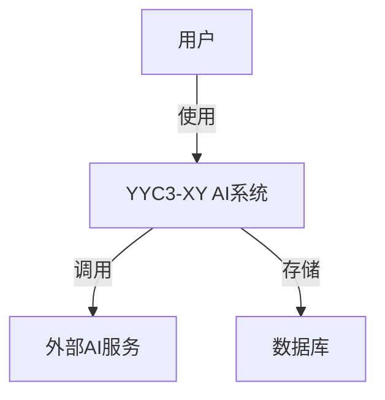
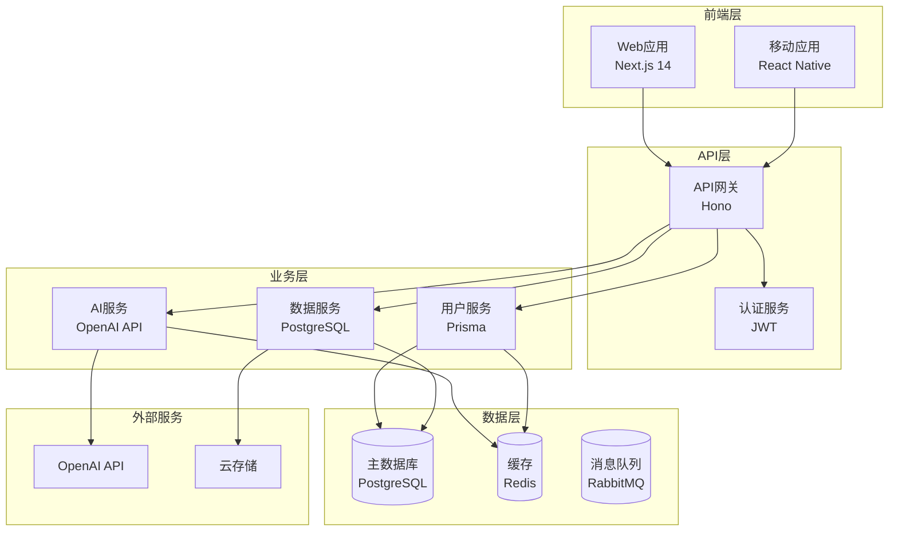
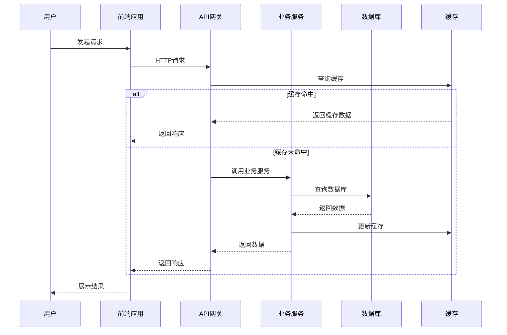

/**

* @file 架构设计绘图规范与工具指南
* @description 提供YYC3-XY项目架构设计绘图的标准规范、工具使用指南和最佳实践
* @module 技巧类-架构设计绘图
* @author YYC³
* @version 1.0.0
* @created 2025-01-30
* @updated 2025-01-30
* @copyright Copyright (c) 2025 YYC³
* @license MIT
 */

# 架构设计绘图规范与工具指南

## 文档信息

* **文档类型**：技巧类

* **所属阶段**：YYC3-XY-架构设计
* **遵循规范**：五高五标五化要求
* **版本号**：V1.0
* **最后更新**：2025-01-30

---

## 核心内容

### 1. 绘图规范原则

#### 1.1 五高原则在绘图中的体现

**高可用性**

* 架构图必须清晰展示关键路径和冗余设计
* 标注故障转移和容错机制
* 明确展示负载均衡和高可用组件

**高性能**

* 展示数据流向和性能关键路径
* 标注缓存策略和优化点
* 体现异步处理和并发设计

**高安全性**

* 标注安全边界和信任域
* 展示认证授权流程
* 明确数据加密和传输安全

**高扩展性**

* 展示模块化设计和接口定义
* 标注水平扩展和垂直扩展点
* 体现微服务拆分和独立部署能力

**高可维护性**

* 清晰的层次结构和职责划分
* 标注配置管理和监控点
* 体现日志和追踪设计

#### 1.2 五标原则在绘图中的体现

**标准化**

* 统一的图形符号和颜色规范
* 标准化的图例和标注格式
* 一致的命名规范

**规范化**

* 遵循UML、C4 Model等国际标准
* 规范的文档结构和元数据
* 标准化的版本管理流程

**自动化**

* 支持从代码自动生成架构图
* 集成CI/CD流水线自动更新
* 自动化质量检查

**智能化**

* 智能布局和自动对齐
* 智能推荐和优化建议
* AI辅助架构设计

**可视化**

* 清晰的视觉层次和信息密度
* 交互式图表和动态展示
* 多维度视图和钻取能力

#### 1.3 五化原则在绘图中的体现

**流程化**

* 标准化的绘图流程和评审流程
* 明确的审批和发布流程
* 流程化的版本迭代管理

**文档化**

* 完整的图表说明和注释
* 标准化的文档模板
* 自动化的文档生成

**工具化**

* 统一的绘图工具链
* 工具集成和自动化脚本
* 插件和扩展支持

**数字化**

* 数字化的资产管理
* 数字化的协作和评审
* 数字化的版本追踪

**生态化**

* 工具生态集成
* 团队协作生态
* 知识沉淀和复用

---

### 2. 架构图类型和用途

#### 2.1 C4模型架构图

**Level 1: System Context（系统上下文图）**

* **用途**：展示系统与外部用户、系统的交互关系
* **包含元素**：当前系统、外部用户、外部系统
* **适用场景**：项目启动、需求分析、干系人沟通



**Level 2: Container（容器图）**

* **用途**：展示系统内部的容器（应用、数据库、缓存等）
* **包含元素**：Web应用、API服务、数据库、缓存、消息队列
* **适用场景**：架构设计、技术选型、部署规划

**Level 3: Component（组件图）**

* **用途**：展示容器内部的组件结构
* **包含元素**：控制器、服务、仓储、工具类
* **适用场景**：详细设计、代码实现、团队协作

**Level 4: Code（代码图）**

* **用途**：展示类和接口的关系
* **包含元素**：类、接口、依赖关系
* **适用场景**：代码审查、重构设计

#### 2.2 UML架构图

**部署图（Deployment Diagram）**

* **用途**：展示物理部署架构
* **包含元素**：节点、设备、连接
* **适用场景**：运维规划、容量规划

**组件图（Component Diagram）**

* **用途**：展示软件组件及其关系
* **包含元素**：组件、接口、依赖
* **适用场景**：系统设计、接口定义

**包图（Package Diagram）**

* **用途**：展示包的层次结构
* **包含元素**：包、依赖关系
* **适用场景**：模块划分、依赖管理

#### 2.3 业务流程图

**业务流程图（Business Process Diagram）**

* **用途**：展示业务流程和规则
* **包含元素**：活动、决策、事件
* **适用场景**：需求分析、业务建模

**数据流图（Data Flow Diagram）**

* **用途**：展示数据在系统中的流动
* **包含元素**：处理、数据存储、外部实体
* **适用场景**：数据设计、接口设计

#### 2.4 技术架构图

**技术栈图（Technology Stack Diagram）**

* **用途**：展示技术栈组成和层次
* **包含元素**：框架、库、工具
* **适用场景**：技术选型、技术决策

**网络拓扑图（Network Topology Diagram）**

* **用途**：展示网络架构和连接
* **包含元素**：网络设备、连接、安全设备
* **适用场景**：网络设计、安全规划

---

### 3. 绘图工具推荐

#### 3.1 专业架构绘图工具

**Draw.io (diagrams.net)**

* **优势**：免费开源、功能强大、支持多种格式
* **适用场景**：通用架构图、流程图、网络图
* **YYC3推荐度**：⭐⭐⭐⭐⭐

**Mermaid**

* **优势**：文本转图表、版本控制友好、支持Markdown
* **适用场景**：文档内嵌图、CI/CD集成
* **YYC3推荐度**：⭐⭐⭐⭐⭐

**PlantUML**

* **优势**：文本转UML、支持多种图表类型
* **适用场景**：UML图、时序图、类图
* **YYC3推荐度**：⭐⭐⭐⭐

**Lucidchart**

* **优势**：在线协作、模板丰富、集成度高
* **适用场景**：团队协作、快速原型
* **YYC3推荐度**：⭐⭐⭐⭐

#### 3.2 云平台架构图工具

**AWS Architecture Icons**

* **优势**：官方图标、AWS服务专用
* **适用场景**：AWS云架构设计

**Azure Architecture Icons**

* **优势**：官方图标、Azure服务专用
* **适用场景**：Azure云架构设计

**Google Cloud Architecture Icons**

* **优势**：官方图标、GCP服务专用
* **适用场景**：GCP云架构设计

#### 3.3 代码生成工具

**Structurizr**

* **优势**：代码生成C4模型图、DSL定义
* **适用场景**：自动化架构图生成

**PlantText**

* **优势**：PlantUML在线编辑器
* **适用场景**：快速PlantUML图表创建

**Mermaid Live Editor**

* **优势**：Mermaid在线编辑器
* **适用场景**：快速Mermaid图表创建

---

### 4. 绘图规范和标准

#### 4.1 图形符号规范

**容器符号**

```
┌─────────────────┐
│   容器名称       │
│   [技术栈]       │
└─────────────────┘
```

**组件符号**

```
┌─────────────────┐
│   组件名称       │
│   [类型]         │
└─────────────────┘
```

**数据库符号**

```
    ┌─────────┐
    │ 数据库   │
    │ [类型]   │
    └─────────┘
```

**外部系统符号**

```
    ┌─────────┐
    │ 外部系统 │
    │ [类型]   │
    └─────────┘
```

#### 4.2 连接线规范

**同步调用**

```
───[调用]───>
```

**异步调用**

```
- - [消息] - ->
```

**数据流**

```
───[数据]───>
```

**依赖关系**

```
- - - - - - >
```

#### 4.3 颜色规范

**前端层**：蓝色系 (#3B82F6)
**后端层**：绿色系 (#10B981)
**数据层**：紫色系 (#8B5CF6)
**外部系统**：橙色系 (#F59E0B)
**安全组件**：红色系 (#EF4444)
**缓存层**：青色系 (#06B6D4)
**消息队列**：黄色系 (#EAB308)

#### 4.4 标注规范

**组件标注格式**

```
组件名称
[技术栈]
[职责描述]
```

**接口标注格式**

```
接口名称
[协议]
[端点]
```

**数据标注格式**

```
数据名称
[格式]
[大小]
```

---

### 5. 绘图最佳实践

#### 5.1 设计原则

**简洁性原则**

* 避免过度复杂的图表
* 适度抽象，突出重点
* 分层展示，逐步细化

**一致性原则**

* 统一的符号和颜色
* 一致的命名规范
* 标准化的布局

**可读性原则**

* 清晰的字体和字号
* 合理的间距和对齐
* 适当的留白

**可维护性原则**

* 模块化设计
* 版本控制友好
* 易于更新和修改

#### 5.2 布局规范

**水平布局**

* 从左到右的数据流
* 清晰的层次结构
* 对齐的组件排列

**垂直布局**

* 从上到下的调用链
* 明确的分层结构
* 对齐的组件排列

**混合布局**

* 根据数据流选择布局
* 保持视觉平衡
* 避免交叉线过多

#### 5.3 命名规范

**组件命名**

* 使用业务领域术语
* 清晰表达职责
* 避免技术术语堆砌

**接口命名**

* 动词+名词格式
* 清晰表达功能
* 符合RESTful规范

**数据命名**

* 使用领域模型术语
* 清晰表达数据含义
* 避免缩写和歧义

---

### 6. 版本控制和协作

#### 6.1 版本管理策略

**版本号规范**

```
v{主版本}.{次版本}.{修订版本}
例如：v1.0.0
```

**版本控制流程**

1. 创建特性分支
2. 更新架构图
3. 提交变更
4. 代码审查
5. 合并到主分支

**变更记录格式**

```
## [版本号] - [日期]
### 新增
- 新增内容描述

### 修改
- 修改内容描述

### 删除
- 删除内容描述
```

#### 6.2 协作规范

**评审流程**

1. 作者提交架构图
2. 团队成员评审
3. 收集反馈意见
4. 修改完善
5. 最终确认

**协作工具**

* Git/GitHub：版本控制
* Draw.io：在线协作
* Mermaid：文档集成
* PR流程：代码审查

**沟通规范**

* 明确评审目标
* 提供建设性反馈
* 及时响应和讨论
* 记录决策和变更

---

### 7. 质量检查清单

#### 7.1 完整性检查

* [ ] 包含所有关键组件
* [ ] 展示所有重要连接
* [ ] 标注所有外部依赖
* [ ] 说明所有数据流

#### 7.2 准确性检查

* [ ] 技术栈标注正确
* [ ] 接口定义准确
* [ ] 数据流方向正确
* [ ] 协议标注准确

#### 7.3 一致性检查

* [ ] 符号使用一致
* [ ] 颜色使用一致
* [ ] 命名规范一致
* [ ] 布局风格一致

#### 7.4 可读性检查

* [ ] 字体清晰可读
* [ ] 布局合理美观
* [ ] 标注简洁明了
* [ ] 图例完整清晰

#### 7.5 标准化检查

* [ ] 遵循五高原则
* [ ] 符合五标要求
* [ ] 体现五化特征
* [ ] 符合YYC3规范

---

### 8. 常见问题和解决方案

#### 8.1 图表过于复杂

**问题**：单个图表包含过多信息，难以理解

**解决方案**：

* 拆分为多个层次图表
* 使用钻取和链接
* 提供详细说明文档

#### 8.2 符号不统一

**问题**：不同作者使用不同的符号和颜色

**解决方案**：

* 建立符号库和模板
* 提供样式指南
* 进行团队培训

#### 8.3 版本管理混乱

**问题**：多个版本并存，难以追踪变更

**解决方案**：

* 使用Git版本控制
* 建立版本号规范
* 记录变更日志

#### 8.4 协作效率低

**问题**：多人协作时沟通成本高，效率低

**解决方案**：

* 使用在线协作工具
* 建立评审流程
* 提供清晰的规范

---

### 9. 示例和模板

#### 9.1 YYC3-XY系统架构图模板



#### 9.2 数据流图模板



---

### 10. 工具配置和集成

#### 10.1 VS Code集成

**推荐插件**

* Markdown Preview Mermaid Support
* PlantUML
* Draw.io Integration

**配置示例**

```json
{
  "markdown.marp.enableHtml": true,
  "plantuml.render": "PlantUMLServer",
  "plantuml.server": "http://www.plantuml.com/plantuml"
}
```

#### 10.2 Git集成

**.gitignore配置**

```
*.drawio~
*.drawio.bak
.puml~
```

**Git Hooks**

```bash
#!/bin/bash
# pre-commit hook for diagram validation
echo "Validating diagrams..."
# 添加验证逻辑
```

#### 10.3 CI/CD集成

**GitHub Actions示例**

```yaml
name: Diagram Validation
on: [push, pull_request]
jobs:
  validate:
    runs-on: ubuntu-latest
    steps:
      - uses: actions/checkout@v2
      - name: Validate Mermaid
        run: |
          npm install -g @mermaid-js/mermaid-cli
          mmdc -i docs/architecture.mmd -o /dev/null
```

---

## 附录

### A. 图例符号库

| 符号 | 含义 | 用途 |
|------|------|------|
| ┌───┐ | 容器 | 应用、服务 |
| ┌───┐ | 组件 | 模块、类 |
| ───> | 同步调用 | HTTP请求 |
| - -> | 异步调用 | 消息队列 |
| ───> | 数据流 | 数据传输 |
| - - - > | 依赖 | 依赖关系 |
| [( )] | 数据库 | 数据存储 |
| ⚙️ | 外部系统 | 第三方服务 |

### B. 颜色代码表

| 用途 | 颜色 | HEX代码 |
|------|------|---------|
| 前端层 | 蓝色 | #3B82F6 |
| 后端层 | 绿色 | #10B981 |
| 数据层 | 紫色 | #8B5CF6 |
| 外部系统 | 橙色 | #F59E0B |
| 安全组件 | 红色 | #EF4444 |
| 缓存层 | 青色 | #06B6D4 |
| 消息队列 | 黄色 | #EAB308 |

### C. 参考资源

**官方文档**

* C4 Model: <https://c4model.com/>
* UML规范: <https://www.uml.org/>
* Mermaid文档: <https://mermaid-js.github.io/>
* PlantUML文档: <https://plantuml.com/>

**YYC3资源**

* YYC3架构规范: /docs/YYC3-XY-架构设计/架构类/
* YYC3技术栈: /docs/YYC3-XY-技术栈/
* YYC3最佳实践: /docs/YYC3-XY-最佳实践/

---

<div align="center">

> 「***YanYuCloudCube***」
> 「***<admin@0379.email>***」
> 「***Words Initiate Quadrants, Language Serves as Core for the Future***」
> 「***All things converge in the cloud pivot; Deep stacks ignite a new era of intelligence***」

</div>
