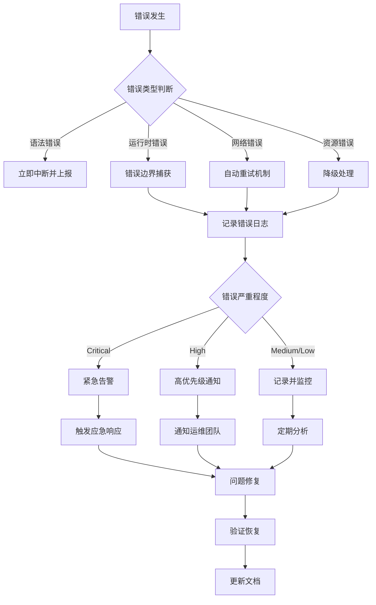
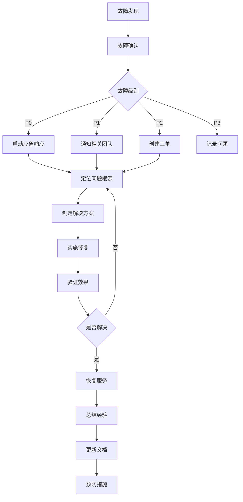

# YYC3-XY 故障排查与应急响应指南

@file 故障排查与应急响应指南
@description 本文档提供YYC3-XY项目的故障排查流程、错误处理机制和应急响应方案，涵盖错误边界、错误报告、告警通知等核心功能
@author YanYuCloudCube
@version V1.0

---

## 文档信息

| 项目 | 内容 |
|------|------|
| 文档名称 | YYC3-XY 故障排查与应急响应指南 |
| 文档版本 | V1.0 |
| 创建日期 | 2025-12-25 |
| 适用范围 | YYC3-XY项目运维、开发、测试团队 |
| 文档类型 | 技巧类 |

---

## 目录

- [1. 概述](#1-概述)
- [2. 错误处理架构](#2-错误处理架构)
- [3. 错误边界机制](#3-错误边界机制)
- [4. 错误报告与日志](#4-错误报告与日志)
- [5. 告警通知系统](#5-告警通知系统)
- [6. 常见故障排查](#6-常见故障排查)
- [7. 应急响应流程](#7-应急响应流程)
- [8. 监控与预警](#8-监控与预警)
- [9. 最佳实践](#9-最佳实践)

---

## 1. 概述

### 1.1 文档目的

本指南旨在为YYC3-XY项目提供系统化的故障排查和应急响应方案，确保在系统出现异常时能够快速定位问题、实施恢复措施，并建立完善的错误处理和监控机制。

### 1.2 核心目标

- **高可用性**：通过完善的错误处理机制确保系统稳定运行
- **快速响应**：建立高效的故障检测和应急响应流程
- **可追溯性**：完整的错误日志和监控记录
- **自动化**：智能化的错误检测和告警通知

### 1.3 适用场景

- 前端应用运行时错误
- 网络请求失败
- API服务异常
- 数据库连接问题
- 性能瓶颈和资源耗尽
- 安全漏洞和攻击行为

### 1.4 五高五标五化原则

本指南严格遵循YYC³「五高五标五化」架构原则：

#### 五高原则

**高可用性**：
- 建立完善的错误边界机制，确保单点故障不影响整体系统
- 实现多级降级策略，在核心服务不可用时提供基础功能
- 设计自动故障转移机制，实现服务快速恢复
- 采用冗余部署，避免单点故障

**高性能**：
- 优化错误处理流程，减少性能开销
- 实现智能错误聚合，避免重复处理
- 采用异步日志上报，不阻塞主流程
- 优化告警通知机制，快速响应关键问题

**高安全**：
- 建立安全事件监控体系，及时发现安全威胁
- 实现敏感信息脱敏，保护用户隐私
- 建立安全应急响应机制，快速处置安全事件
- 定期进行安全审计，识别潜在风险

**高扩展**：
- 设计模块化错误处理架构，便于功能扩展
- 支持多渠道告警通知，适应不同场景需求
- 提供灵活的规则配置，支持动态调整
- 支持插件化集成，便于接入第三方监控服务

**高可维护**：
- 建立完善的文档体系，降低维护成本
- 实现标准化错误处理流程，提高可维护性
- 提供详细的日志记录，便于问题追踪
- 建立知识库，积累故障处理经验

#### 五标体系

**标准化**：
- 统一错误分类标准，便于问题归类和分析
- 标准化日志格式，便于日志解析和查询
- 统一告警级别定义，明确响应优先级
- 标准化应急响应流程，确保处理一致性

**规范化**：
- 规范错误上报格式，确保信息完整准确
- 规范告警通知内容，提高信息传达效率
- 规范故障处理流程，确保问题得到妥善处理
- 规范文档编写标准，便于知识传承

**自动化**：
- 实现自动错误检测和上报，减少人工干预
- 自动化告警通知，提高响应速度
- 自动化故障诊断，辅助快速定位问题
- 自动化恢复机制，减少服务中断时间

**智能化**：
- 智能错误分类，自动识别错误类型
- 智能告警聚合，避免告警风暴
- 智能故障预测，提前发现潜在问题
- 智能推荐解决方案，提高问题解决效率

**可视化**：
- 提供实时监控仪表盘，直观展示系统状态
- 可视化错误趋势分析，识别问题规律
- 可视化告警统计，评估告警效果
- 可视化故障报告，便于问题复盘

#### 五化架构

**流程化**：
- 建立标准化的故障处理流程
- 明确各阶段职责和交付物
- 定义清晰的决策点和审批流程
- 建立跨团队协作机制

**文档化**：
- 完善故障排查文档，提供详细指导
- 记录故障处理过程，积累经验
- 维护常见问题知识库，提高复用性
- 定期更新文档，确保内容准确

**工具化**：
- 提供故障诊断工具，辅助问题定位
- 开发自动化脚本，提高处理效率
- 集成监控平台，实现统一管理
- 建立告警管理工具，便于告警处理

**数字化**：
- 建立故障数据仓库，支持数据分析
- 实现故障指标量化，客观评估系统健康度
- 建立故障预测模型，提前预警潜在风险
- 数字化故障报告，便于统计分析

**生态化**：
- 建立故障处理生态，整合各类工具和服务
- 对接第三方监控平台，扩展监控能力
- 集成告警通知渠道，覆盖多种通知方式
- 建立故障处理社区，促进经验分享

---

## 2. 错误处理架构

### 2.1 架构层次

```
┌─────────────────────────────────────────────────────────┐
│                    用户界面层                             │
│  错误提示UI | 错误恢复按钮 | 降级功能展示                    │
└─────────────────────────────────────────────────────────┘
                            ↓
┌─────────────────────────────────────────────────────────┐
│                  错误边界层 (Error Boundary)               │
│  React错误边界 | 网络错误边界 | 异步错误捕获                │
└─────────────────────────────────────────────────────────┘
                            ↓
┌─────────────────────────────────────────────────────────┐
│                  错误处理层 (Error Handler)               │
│  错误分类 | 错误重试 | 错误恢复 | 错误上报                │
└─────────────────────────────────────────────────────────┘
                            ↓
┌─────────────────────────────────────────────────────────┐
│                  日志记录层 (Logging)                     │
│  控制台日志 | 文件日志 | 外部监控服务 (Sentry等)          │
└─────────────────────────────────────────────────────────┘
                            ↓
┌─────────────────────────────────────────────────────────┐
│                  告警通知层 (Alerting)                    │
│  告警规则 | 通知渠道 | 告警分级 | 自动化处理              │
└─────────────────────────────────────────────────────────┘
```

### 2.2 错误分类体系

| 错误类型 | 严重程度 | 处理策略 | 通知级别 |
|----------|----------|----------|----------|
| 语法错误 | Critical | 立即中断 | 紧急 |
| 运行时错误 | High | 错误边界捕获 | 高 |
| 网络错误 | Medium | 自动重试 | 中 |
| 资源加载错误 | Medium | 降级处理 | 中 |
| 性能警告 | Low | 监控记录 | 低 |
| 用户输入错误 | Low | 提示纠正 | 低 |

### 2.3 错误处理流程



---

## 3. 错误边界机制

### 3.1 核心错误边界

#### 3.1.1 基础错误边界实现

**文件位置**: `components/optimization/ErrorBoundary.tsx`

**核心功能**:
- 捕获React组件树中的JavaScript错误
- 提供友好的错误UI展示
- 支持错误重试机制
- 自动上报错误信息

**关键代码**:

```typescript
export class ErrorBoundary extends Component<ErrorBoundaryProps, ErrorBoundaryState> {
  private retryCount = 0

  constructor(props: ErrorBoundaryProps) {
    super(props)
    this.state = {
      hasError: false,
      error: null,
      errorInfo: null
    }
  }

  static getDerivedStateFromError(error: Error): ErrorBoundaryState {
    return {
      hasError: true,
      error,
      errorInfo: null
    }
  }

  componentDidCatch(error: Error, errorInfo: React.ErrorInfo) {
    this.setState({
      error,
      errorInfo
    })

    this.logErrorToService(error, errorInfo)
    this.props.onError?.(error, errorInfo)
  }

  private handleRetry = () => {
    this.retryCount++
    this.setState({
      hasError: false,
      error: null,
      errorInfo: null
    })
  }
}
```

**使用示例**:

```typescript
<ErrorBoundary
  onError={(error, errorInfo) => {
    console.error('全局错误捕获:', error, errorInfo)
  }}
  fallback={<ErrorFallback />}
>
  <App />
</ErrorBoundary>
```

#### 3.1.2 网络错误边界

**核心功能**:
- 专门处理网络请求失败
- 监听在线/离线状态
- 自动重试网络请求
- 提供离线模式提示

**关键代码**:

```typescript
export class NetworkErrorBoundary extends Component<
  { children: ReactNode; fallback?: ReactNode },
  { hasNetworkError: boolean; error: Error | null }
> {
  static getDerivedStateFromError(error: Error) {
    if (
      error.message.includes('Network Error') ||
      error.message.includes('Failed to fetch') ||
      error.message.includes('Network request failed')
    ) {
      return {
        hasNetworkError: true,
        error
      }
    }
    return null
  }

  componentDidMount() {
    window.addEventListener('online', this.handleOnline)
    window.addEventListener('offline', this.handleOffline)
  }

  componentWillUnmount() {
    window.removeEventListener('online', this.handleOnline)
    window.removeEventListener('offline', this.handleOffline)
  }

  private handleOnline = () => {
    this.setState({ hasNetworkError: false })
  }

  private handleOffline = () => {
    this.setState({ hasNetworkError: true, error: new Error('Network offline') })
  }
}
```

### 3.2 错误边界配置

#### 3.2.1 全局错误边界

**配置位置**: `app/layout.tsx`

```typescript
export default function RootLayout({ children }: { children: React.ReactNode }) {
  return (
    <html lang="zh-CN">
      <body>
        <ErrorBoundary
          fallback={<GlobalErrorFallback />}
          onError={handleGlobalError}
        >
          {children}
        </ErrorBoundary>
      </body>
    </html>
  )
}
```

#### 3.2.2 局部错误边界

**使用场景**: 针对特定功能模块的错误隔离

```typescript
<ErrorBoundary
  fallback={<ModuleErrorFallback />}
  onError={(error) => trackModuleError('feature-module', error)}
>
  <FeatureModule />
</ErrorBoundary>
```

### 3.3 错误恢复策略

| 策略类型 | 触发条件 | 恢复方式 | 适用场景 |
|----------|----------|----------|----------|
| 自动重试 | 网络错误、临时故障 | 自动重新请求 | API调用、资源加载 |
| 用户重试 | 可恢复错误 | 提供重试按钮 | 表单提交、数据刷新 |
| 降级处理 | 非核心功能故障 | 显示简化内容 | 推荐内容、广告模块 |
| 优雅降级 | 关键功能故障 | 显示友好提示 | 核心服务不可用 |

---

## 4. 错误报告与日志

### 4.1 错误报告API

#### 4.1.1 API端点

**端点**: `POST /api/error-report`

**文件位置**: `app/api/error-report/route.ts`

**请求格式**:

```typescript
interface ErrorReport {
  error: {
    message: string
    stack?: string
    name: string
  }
  errorInfo?: {
    componentStack: string
    errorBoundaryStack?: string
  }
  userAgent: string
  url: string
  timestamp: string
  userId?: string
  sessionId?: string
}
```

**响应格式**:

```typescript
{
  success: boolean
  message: string
  errorId?: string
}
```

#### 4.1.2 关键错误检测

**关键错误类型**:

```typescript
function isCriticalError(report: ErrorReport): boolean {
  const criticalErrors = [
    'ChunkLoadError',
    'Loading CSS chunk',
    'Network request failed',
    'Failed to fetch dynamically imported module',
    'Out of memory'
  ]

  return criticalErrors.some(error =>
    report.error.message.includes(error)
  )
}
```

### 4.2 日志记录策略

#### 4.2.1 日志级别

| 级别 | 说明 | 使用场景 |
|------|------|----------|
| ERROR | 错误信息 | 系统异常、功能失败 |
| WARN | 警告信息 | 潜在问题、性能下降 |
| INFO | 一般信息 | 正常操作、状态变更 |
| DEBUG | 调试信息 | 开发调试、详细流程 |

#### 4.2.2 日志格式

**标准日志格式**:

```typescript
interface LogEntry {
  timestamp: string
  level: 'ERROR' | 'WARN' | 'INFO' | 'DEBUG'
  message: string
  context?: {
    userId?: string
    sessionId?: string
    url?: string
    userAgent?: string
    error?: Error
    [key: string]: any
  }
}
```

**日志示例**:

```typescript
console.error('Error Report:', {
  message: report.error.message,
  stack: report.error.stack,
  timestamp: report.timestamp,
  url: report.url,
  userAgent: report.userAgent
})
```

### 4.3 外部监控集成

#### 4.3.1 Sentry集成

**配置示例**:

```typescript
import * as Sentry from '@sentry/nextjs'

Sentry.init({
  dsn: process.env.NEXT_PUBLIC_SENTRY_DSN,
  environment: process.env.NODE_ENV,
  tracesSampleRate: 1.0,
  beforeSend(event, hint) {
    if (event.exception) {
      event.level = 'error'
    }
    return event
  }
})
```

#### 4.3.2 错误上报函数

```typescript
async function logErrorToExternalService(report: ErrorReport) {
  try {
    if (isCriticalError(report)) {
      await sendSlackNotification(report)
    }
    
    await Sentry.captureException(new Error(report.error.message), {
      tags: {
        errorType: report.error.name,
        url: report.url
      },
      extra: {
        stack: report.error.stack,
        userAgent: report.userAgent
      }
    })
  } catch (error) {
    console.warn('Failed to send error to external service:', error)
  }
}
```

---

## 5. 告警通知系统

### 5.1 告警系统架构

**文件位置**: `components/analytics/AlertNotificationSystem.tsx`

**核心功能**:
- 实时告警监控
- 告警分级管理
- 多渠道通知
- 自动化处理

### 5.2 告警数据结构

```typescript
interface AlertData {
  id: string
  title: string
  description: string
  severity: 'critical' | 'high' | 'medium' | 'low'
  type: 'error' | 'warning' | 'info' | 'success'
  timestamp: string
  acknowledged: boolean
  resolved: boolean
  actions?: Array<{
    id: string
    label: string
    type: 'primary' | 'secondary' | 'danger'
  }>
}
```

### 5.3 告警操作

#### 5.3.1 告警确认

```typescript
acknowledgeAlert = (alertId: string) => {
  setAlerts(prev => prev.map(alert => 
    alert.id === alertId ? { ...alert, acknowledged: true } : alert
  ))
}
```

#### 5.3.2 告警解决

```typescript
resolveAlert = (alertId: string) => {
  setAlerts(prev => prev.map(alert => 
    alert.id === alertId ? { ...alert, resolved: true } : alert
  ))
}
```

#### 5.3.3 告警操作执行

```typescript
executeAction = (alertId: string, actionId: string) => {
  console.log(`执行操作: ${actionId} for alert: ${alertId}`)
  
  if (actionId === 'restart' || actionId === 'scale') {
    setTimeout(() => {
      resolveAlert(alertId)
    }, 2000)
  }
}
```

### 5.4 告警过滤

```typescript
const filteredAlerts = alerts.filter(alert => {
  if (filter === 'all') return true
  if (filter === 'unresolved') return !alert.resolved
  if (filter === 'unacknowledged') return !alert.acknowledged
  if (filter === 'critical') return alert.severity === 'critical'
  return alert.type === filter
})
```

### 5.5 通知渠道

| 渠道 | 触发级别 | 响应时间 | 适用场景 |
|------|----------|----------|----------|
| Slack | Critical/High | < 5分钟 | 紧急故障、安全事件 |
| 邮件 | High/Medium | < 15分钟 | 重要告警、定期报告 |
| 短信 | Critical | < 1分钟 | 严重故障、服务中断 |
| 应用内通知 | All | 实时 | 用户相关告警 |

---

## 6. 常见故障排查

### 6.1 前端运行时错误

#### 6.1.1 错误现象

- 页面白屏
- 功能异常
- 组件渲染失败

#### 6.1.2 排查步骤

1. **检查错误边界日志**
   ```typescript
   componentDidCatch(error: Error, errorInfo: React.ErrorInfo) {
     console.error('[ErrorBoundary]', error, errorInfo)
   }
   ```

2. **分析错误堆栈**
   - 定位错误发生位置
   - 识别错误类型
   - 检查依赖关系

3. **检查浏览器控制台**
   - 查看完整错误信息
   - 检查网络请求状态
   - 验证资源加载情况

#### 6.1.3 解决方案

| 错误类型 | 解决方案 |
|----------|----------|
| 组件渲染错误 | 检查组件props、state、生命周期 |
| 状态更新错误 | 验证状态更新逻辑、避免循环依赖 |
| 事件处理错误 | 检查事件绑定、参数传递 |
| 异步操作错误 | 添加错误处理、检查Promise状态 |

### 6.2 网络请求失败

#### 6.2.1 错误现象

- API请求超时
- 数据加载失败
- 网络连接中断

#### 6.2.2 排查步骤

1. **检查网络状态**
   ```typescript
   window.addEventListener('offline', () => {
     console.warn('Network offline detected')
   })
   ```

2. **验证API端点**
   - 检查URL正确性
   - 验证请求方法
   - 确认请求参数

3. **分析响应状态**
   - 检查HTTP状态码
   - 验证响应格式
   - 检查错误信息

#### 6.2.3 解决方案

| 问题类型 | 解决方案 |
|----------|----------|
| 超时错误 | 增加超时时间、优化请求、使用重试机制 |
| CORS错误 | 配置服务器CORS、使用代理 |
| 404错误 | 检查API路径、验证路由配置 |
| 500错误 | 检查服务器日志、联系后端团队 |

### 6.3 资源加载失败

#### 6.3.1 错误现象

- CSS样式丢失
- JavaScript文件加载失败
- 图片资源无法显示

#### 6.3.2 排查步骤

1. **检查资源路径**
   ```typescript
   const checkResource = (url: string) => {
     fetch(url)
       .then(response => {
         if (!response.ok) {
           throw new Error(`Resource load failed: ${url}`)
         }
       })
       .catch(error => {
         console.error(error)
       })
   }
   ```

2. **验证CDN配置**
   - 检查CDN可用性
   - 验证CDN路径
   - 测试CDN响应

3. **检查构建配置**
   - 验证webpack配置
   - 检查资源打包
   - 确认资源哈希

#### 6.3.3 解决方案

| 问题类型 | 解决方案 |
|----------|----------|
| ChunkLoadError | 清除缓存、重新构建、检查CDN |
| CSS加载失败 | 检查CSS路径、验证构建配置 |
| 图片加载失败 | 使用备用图片、优化图片格式 |

### 6.4 性能问题

#### 6.4.1 错误现象

- 页面加载缓慢
- 交互响应延迟
- 内存占用过高

#### 6.4.2 排查步骤

1. **性能监控**
   ```typescript
   const performanceObserver = new PerformanceObserver((list) => {
     for (const entry of list.getEntries()) {
       console.log('[Performance]', entry)
     }
   })
   performanceObserver.observe({ entryTypes: ['measure', 'navigation'] })
   ```

2. **分析性能指标**
   - LCP (Largest Contentful Paint)
   - FID (First Input Delay)
   - CLS (Cumulative Layout Shift)

3. **检查资源使用**
   - CPU使用率
   - 内存占用
   - 网络流量

#### 6.4.3 解决方案

| 问题类型 | 解决方案 |
|----------|----------|
| 加载缓慢 | 代码分割、懒加载、CDN加速 |
| 交互延迟 | 优化事件处理、减少重渲染 |
| 内存泄漏 | 清理定时器、解绑事件、释放引用 |

---

## 7. 应急响应流程

### 7.1 应急响应级别

| 级别 | 定义 | 响应时间 | 处理团队 |
|------|------|----------|----------|
| P0 - 严重 | 核心服务不可用，影响所有用户 | < 15分钟 | 全员 |
| P1 - 高 | 主要功能异常，影响大部分用户 | < 1小时 | 开发+运维 |
| P2 - 中 | 部分功能异常，影响部分用户 | < 4小时 | 开发团队 |
| P3 - 低 | 次要问题，影响少数用户 | < 24小时 | 相关开发 |

### 7.2 应急响应流程图



### 7.3 应急响应检查清单

#### 7.3.1 故障发现阶段

- [ ] 确认故障现象
- [ ] 记录发生时间
- [ ] 收集错误日志
- [ ] 评估影响范围
- [ ] 确定故障级别

#### 7.3.2 故障处理阶段

- [ ] 通知相关人员
- [ ] 建立沟通渠道
- [ ] 定位问题根源
- [ ] 制定解决方案
- [ ] 实施修复措施

#### 7.3.3 恢复验证阶段

- [ ] 验证功能正常
- [ ] 检查性能指标
- [ ] 确认数据完整性
- [ ] 通知相关方
- [ ] 更新系统状态

#### 7.3.4 事后总结阶段

- [ ] 编写故障报告
- [ ] 分析根本原因
- [ ] 制定改进措施
- [ ] 更新文档
- [ ] 培训相关人员

### 7.4 应急联系信息

| 角色 | 负责人 | 联系方式 | 响应时间 |
|------|--------|----------|----------|
| 技术负责人 | - | - | 24小时 |
| 运维负责人 | - | - | 24小时 |
| 安全负责人 | - | - | 24小时 |
| 产品负责人 | - | - | 工作时间 |

---

## 8. 监控与预警

### 8.1 监控指标

#### 8.1.1 系统指标

| 指标类别 | 具体指标 | 正常范围 | 告警阈值 |
|----------|----------|----------|----------|
| 性能 | 页面加载时间 | < 3秒 | > 5秒 |
| 性能 | API响应时间 | < 500ms | > 2秒 |
| 资源 | CPU使用率 | < 70% | > 90% |
| 资源 | 内存使用率 | < 80% | > 95% |
| 错误 | 错误率 | < 0.1% | > 1% |
| 可用性 | 服务可用率 | > 99.9% | < 99.5% |

#### 8.1.2 业务指标

| 指标类别 | 具体指标 | 监控目的 |
|----------|----------|----------|
| 用户体验 | 页面跳出率 | 评估内容质量 |
| 用户行为 | 功能使用率 | 评估功能价值 |
| 转化 | 转化率 | 评估业务效果 |
| 留存 | 用户留存率 | 评估产品粘性 |

### 8.2 预警规则

#### 8.2.1 错误率预警

```typescript
interface ErrorRateAlertRule {
  windowSize: number // 时间窗口（秒）
  errorThreshold: number // 错误率阈值（百分比）
  sampleSize: number // 最小样本数
  cooldownPeriod: number // 冷却期（秒）
}

class ErrorRateMonitor {
  private errorCount = 0
  private totalCount = 0
  private lastAlertTime = 0

  checkErrorRate(rule: ErrorRateAlertRule): boolean {
    const now = Date.now()
    
    // 检查冷却期
    if (now - this.lastAlertTime < rule.cooldownPeriod * 1000) {
      return false
    }
    
    // 检查样本数
    if (this.totalCount < rule.sampleSize) {
      return false
    }
    
    // 计算错误率
    const errorRate = (this.errorCount / this.totalCount) * 100
    
    if (errorRate > rule.errorThreshold) {
      this.lastAlertTime = now
      return true
    }
    
    return false
  }
}
```

#### 8.2.2 性能预警

```typescript
interface PerformanceAlertRule {
  metric: 'lcp' | 'fid' | 'cls' | 'ttfb'
  threshold: number
  comparison: 'greater' | 'less'
  duration: number // 持续时间（秒）
}

class PerformanceMonitor {
  private metricHistory: Map<string, number[]> = new Map()
  
  checkPerformance(rule: PerformanceAlertRule): boolean {
    const history = this.metricHistory.get(rule.metric) || []
    
    if (history.length === 0) {
      return false
    }
    
    const recentValues = history.slice(-rule.duration)
    const exceedsThreshold = recentValues.every(value => {
      return rule.comparison === 'greater' 
        ? value > rule.threshold 
        : value < rule.threshold
    })
    
    return exceedsThreshold
  }
}
```

#### 8.2.3 资源预警

```typescript
interface ResourceAlertRule {
  type: 'cpu' | 'memory' | 'disk'
  threshold: number // 百分比
  duration: number // 持续时间（秒）
}

class ResourceMonitor {
  private resourceHistory: Map<string, number[]> = new Map()
  
  checkResource(rule: ResourceAlertRule): boolean {
    const history = this.resourceHistory.get(rule.type) || []
    
    if (history.length === 0) {
      return false
    }
    
    const recentValues = history.slice(-rule.duration)
    const exceedsThreshold = recentValues.every(
      value => value > rule.threshold
    )
    
    return exceedsThreshold
  }
}
```

### 8.3 监控仪表盘

#### 8.3.1 仪表盘组件

**文件位置**: `components/monitoring/Dashboard.tsx`

```typescript
import { useState, useEffect } from 'react'

interface DashboardMetrics {
  errorRate: number
  responseTime: number
  cpuUsage: number
  memoryUsage: number
  activeUsers: number
  uptime: number
}

export const MonitoringDashboard: React.FC = () => {
  const [metrics, setMetrics] = useState<DashboardMetrics>({
    errorRate: 0,
    responseTime: 0,
    cpuUsage: 0,
    memoryUsage: 0,
    activeUsers: 0,
    uptime: 100
  })
  
  const [alerts, setAlerts] = useState<AlertData[]>([])
  
  useEffect(() => {
    const interval = setInterval(async () => {
      const [metricsData, alertsData] = await Promise.all([
        fetch('/api/metrics').then(r => r.json()),
        fetch('/api/alerts').then(r => r.json())
      ])
      
      setMetrics(metricsData)
      setAlerts(alertsData)
    }, 5000)
    
    return () => clearInterval(interval)
  }, [])
  
  return (
    <div className="monitoring-dashboard">
      <div className="metrics-grid">
        <MetricCard 
          title="错误率" 
          value={`${metrics.errorRate.toFixed(2)}%`}
          status={metrics.errorRate > 1 ? 'error' : 'success'}
        />
        <MetricCard 
          title="响应时间" 
          value={`${metrics.responseTime}ms`}
          status={metrics.responseTime > 2000 ? 'warning' : 'success'}
        />
        <MetricCard 
          title="CPU使用率" 
          value={`${metrics.cpuUsage.toFixed(1)}%`}
          status={metrics.cpuUsage > 90 ? 'error' : 'success'}
        />
        <MetricCard 
          title="内存使用率" 
          value={`${metrics.memoryUsage.toFixed(1)}%`}
          status={metrics.memoryUsage > 95 ? 'error' : 'success'}
        />
        <MetricCard 
          title="活跃用户" 
          value={metrics.activeUsers}
          status="info"
        />
        <MetricCard 
          title="系统可用性" 
          value={`${metrics.uptime.toFixed(2)}%`}
          status={metrics.uptime > 99.5 ? 'success' : 'error'}
        />
      </div>
      
      <AlertList alerts={alerts} />
    </div>
  )
}
```

#### 8.3.2 趋势图表

```typescript
import { LineChart, Line, XAxis, YAxis, CartesianGrid, Tooltip, Legend } from 'recharts'

interface TrendData {
  timestamp: string
  errorRate: number
  responseTime: number
}

export const TrendChart: React.FC<{ data: TrendData[] }> = ({ data }) => {
  return (
    <LineChart width={800} height={400} data={data}>
      <CartesianGrid strokeDasharray="3 3" />
      <XAxis dataKey="timestamp" />
      <YAxis />
      <Tooltip />
      <Legend />
      <Line 
        type="monotone" 
        dataKey="errorRate" 
        stroke="#ff0000" 
        name="错误率 (%)"
      />
      <Line 
        type="monotone" 
        dataKey="responseTime" 
        stroke="#00ff00" 
        name="响应时间 (ms)"
      />
    </LineChart>
  )
}
```

### 8.4 告警聚合

#### 8.4.1 告警聚合策略

```typescript
interface AggregationRule {
  key: string // 聚合键
  windowSize: number // 时间窗口（秒）
  maxAlerts: number // 最大告警数
}

class AlertAggregator {
  private alertBuffer: Map<string, AlertData[]> = new Map()
  
  aggregate(alert: AlertData, rule: AggregationRule): AlertData | null {
    const key = this.getAggregationKey(alert, rule.key)
    const buffer = this.alertBuffer.get(key) || []
    
    // 添加新告警
    buffer.push(alert)
    
    // 过滤时间窗口外的告警
    const now = Date.now()
    const recentAlerts = buffer.filter(
      a => now - new Date(a.timestamp).getTime() < rule.windowSize * 1000
    )
    
    this.alertBuffer.set(key, recentAlerts)
    
    // 检查是否超过最大告警数
    if (recentAlerts.length > rule.maxAlerts) {
      return this.createAggregatedAlert(recentAlerts, key)
    }
    
    return null
  }
  
  private getAggregationKey(alert: AlertData, key: string): string {
    return key.split('.').reduce((obj, prop) => obj?.[prop], alert as any) || 'default'
  }
  
  private createAggregatedAlert(alerts: AlertData[], key: string): AlertData {
    return {
      id: `aggregated-${Date.now()}`,
      title: `聚合告警: ${key}`,
      description: `在过去时间内发生了 ${alerts.length} 次相同类型的告警`,
      severity: 'high',
      type: 'warning',
      timestamp: new Date().toISOString(),
      acknowledged: false,
      resolved: false
    }
  }
}
```

#### 8.4.2 告警去重

```typescript
class AlertDeduplicator {
  private recentAlerts: Map<string, number> = new Map()
  private dedupWindow: number = 300 // 5分钟去重窗口
  
  isDuplicate(alert: AlertData): boolean {
    const key = this.getAlertKey(alert)
    const lastTime = this.recentAlerts.get(key) || 0
    const now = Date.now()
    
    if (now - lastTime < this.dedupWindow * 1000) {
      return true
    }
    
    this.recentAlerts.set(key, now)
    return false
  }
  
  private getAlertKey(alert: AlertData): string {
    return `${alert.type}-${alert.title}-${alert.severity}`
  }
}
```

---

## 9. 最佳实践

### 9.1 错误处理最佳实践

#### 9.1.1 前端错误处理

**原则**：
- 优雅降级，确保用户界面始终可用
- 提供友好的错误提示，避免技术术语
- 实现自动恢复机制，减少用户操作
- 记录详细错误信息，便于问题排查

**实现示例**：

```typescript
// 优雅降级组件
interface FallbackProps {
  error: Error
  retry: () => void
}

const ErrorFallback: React.FC<FallbackProps> = ({ error, retry }) => {
  return (
    <div className="error-fallback">
      <h2>出现了一些问题</h2>
      <p>抱歉，页面加载时遇到了错误。您可以尝试刷新页面。</p>
      <button onClick={retry}>重试</button>
      <details>
        <summary>错误详情</summary>
        <pre>{error.message}</pre>
      </details>
    </div>
  )
}

// 自动重试Hook
function useAutoRetry<T>(
  fn: () => Promise<T>,
  options: { maxRetries?: number; delay?: number } = {}
) {
  const { maxRetries = 3, delay = 1000 } = options
  const [retryCount, setRetryCount] = useState(0)
  const [data, setData] = useState<T | null>(null)
  const [error, setError] = useState<Error | null>(null)
  
  const execute = useCallback(async () => {
    try {
      const result = await fn()
      setData(result)
      setError(null)
      setRetryCount(0)
      return result
    } catch (err) {
      if (retryCount < maxRetries) {
        setRetryCount(prev => prev + 1)
        await new Promise(resolve => setTimeout(resolve, delay))
        return execute()
      }
      setError(err as Error)
      throw err
    }
  }, [fn, retryCount, maxRetries, delay])
  
  return { data, error, retry: execute, retryCount }
}
```

#### 9.1.2 后端错误处理

**原则**：
- 统一错误响应格式
- 实现错误分类和分级
- 提供详细的错误日志
- 支持错误追踪和关联

**实现示例**：

```typescript
// 统一错误响应
interface ErrorResponse {
  success: false
  error: {
    code: string
    message: string
    details?: any
    requestId: string
  }
}

// 错误类型定义
class AppError extends Error {
  constructor(
    public code: string,
    message: string,
    public statusCode: number = 500,
    public details?: any
  ) {
    super(message)
    this.name = 'AppError'
  }
}

// 错误处理中间件
export function errorHandler(
  error: Error,
  req: Request,
  res: Response,
  next: NextFunction
) {
  const requestId = req.headers.get('x-request-id') || generateRequestId()
  
  if (error instanceof AppError) {
    const response: ErrorResponse = {
      success: false,
      error: {
        code: error.code,
        message: error.message,
        details: error.details,
        requestId
      }
    }
    
    logger.error('Application error', {
      code: error.code,
      message: error.message,
      requestId,
      stack: error.stack
    })
    
    return res.status(error.statusCode).json(response)
  }
  
  // 未知错误
  const response: ErrorResponse = {
    success: false,
    error: {
      code: 'INTERNAL_ERROR',
      message: '服务器内部错误',
      requestId
    }
  }
  
  logger.error('Unknown error', {
    message: error.message,
    requestId,
    stack: error.stack
  })
  
  return res.status(500).json(response)
}
```

### 9.2 监控最佳实践

#### 9.2.1 监控指标选择

**核心指标**：
- **可用性指标**：服务可用率、故障次数、恢复时间
- **性能指标**：响应时间、吞吐量、错误率
- **资源指标**：CPU使用率、内存使用率、磁盘使用率
- **业务指标**：用户活跃度、功能使用率、转化率

**指标采集示例**：

```typescript
// 性能指标采集
class PerformanceCollector {
  private metrics: Map<string, number[]> = new Map()
  
  recordMetric(name: string, value: number) {
    const history = this.metrics.get(name) || []
    history.push(value)
    
    // 保留最近1000条记录
    if (history.length > 1000) {
      history.shift()
    }
    
    this.metrics.set(name, history)
  }
  
  getMetricStats(name: string) {
    const history = this.metrics.get(name) || []
    
    if (history.length === 0) {
      return null
    }
    
    const sorted = [...history].sort((a, b) => a - b)
    
    return {
      min: sorted[0],
      max: sorted[sorted.length - 1],
      avg: sorted.reduce((sum, val) => sum + val, 0) / sorted.length,
      p50: sorted[Math.floor(sorted.length * 0.5)],
      p95: sorted[Math.floor(sorted.length * 0.95)],
      p99: sorted[Math.floor(sorted.length * 0.99)]
    }
  }
}

// 使用示例
const collector = new PerformanceCollector()

// 记录API响应时间
const startTime = performance.now()
await apiCall()
const responseTime = performance.now() - startTime
collector.recordMetric('api.responseTime', responseTime)

// 获取统计信息
const stats = collector.getMetricStats('api.responseTime')
console.log('P95响应时间:', stats?.p95)
```

#### 9.2.2 告警规则配置

**原则**：
- 避免告警风暴，合理设置阈值
- 分级告警，区分优先级
- 设置冷却期，避免重复告警
- 定期review和优化告警规则

**配置示例**：

```typescript
// 告警规则配置
const alertRules: AlertRule[] = [
  {
    id: 'high-error-rate',
    name: '高错误率告警',
    type: 'error-rate',
    severity: 'critical',
    conditions: {
      threshold: 5,
      window: 300,
      sampleSize: 100
    },
    actions: ['slack', 'sms'],
    cooldown: 600
  },
  {
    id: 'slow-response',
    name: '响应缓慢告警',
    type: 'response-time',
    severity: 'warning',
    conditions: {
      threshold: 2000,
      window: 60,
      sampleSize: 10
    },
    actions: ['slack', 'email'],
    cooldown: 300
  },
  {
    id: 'high-cpu',
    name: 'CPU使用率过高',
    type: 'resource',
    severity: 'high',
    conditions: {
      threshold: 90,
      window: 300,
      sampleSize: 10
    },
    actions: ['slack'],
    cooldown: 600
  }
]
```

### 9.3 应急响应最佳实践

#### 9.3.1 故障响应流程

**阶段一：故障发现（0-5分钟）**
- 自动监控发现异常
- 用户反馈收集
- 确认故障现象
- 评估影响范围
- 确定故障级别

**阶段二：故障定位（5-30分钟）**
- 收集错误日志
- 分析系统指标
- 定位问题根源
- 制定解决方案
- 评估修复风险

**阶段三：故障修复（30-60分钟）**
- 实施修复措施
- 监控修复效果
- 验证功能恢复
- 通知相关方
- 更新系统状态

**阶段四：事后总结（24小时内）**
- 编写故障报告
- 分析根本原因
- 制定改进措施
- 更新文档
- 培训相关人员

#### 9.3.2 故障处理技巧

**快速定位技巧**：

```typescript
// 故障诊断工具
class FaultDiagnoser {
  async diagnose(issue: string) {
    const checks = [
      this.checkSystemHealth,
      this.checkDatabaseConnection,
      this.checkApiEndpoints,
      this.checkResourceUsage,
      this.checkRecentDeployments
    ]
    
    const results = await Promise.allSettled(
      checks.map(check => check.call(this))
    )
    
    return {
      issue,
      checks: results.map((result, index) => ({
        name: checks[index].name,
        status: result.status,
        result: result.status === 'fulfilled' ? result.value : result.reason
      }))
    }
  }
  
  private async checkSystemHealth() {
    const response = await fetch('/api/health')
    return await response.json()
  }
  
  private async checkDatabaseConnection() {
    // 实现数据库连接检查
  }
  
  private async checkApiEndpoints() {
    // 实现API端点检查
  }
  
  private async checkResourceUsage() {
    // 实现资源使用检查
  }
  
  private async checkRecentDeployments() {
    // 实现最近部署检查
  }
}
```

**快速恢复技巧**：

```typescript
// 快速恢复策略
class RecoveryManager {
  private strategies: Map<string, RecoveryStrategy> = new Map()
  
  registerStrategy(name: string, strategy: RecoveryStrategy) {
    this.strategies.set(name, strategy)
  }
  
  async recover(issueType: string): Promise<boolean> {
    const strategy = this.strategies.get(issueType)
    
    if (!strategy) {
      console.warn(`No recovery strategy found for: ${issueType}`)
      return false
    }
    
    try {
      await strategy.execute()
      return true
    } catch (error) {
      console.error(`Recovery failed for ${issueType}:`, error)
      return false
    }
  }
}

interface RecoveryStrategy {
  name: string
  execute: () => Promise<void>
  rollback?: () => Promise<void>
}

// 使用示例
const recoveryManager = new RecoveryManager()

recoveryManager.registerStrategy('database-connection', {
  name: '数据库连接恢复',
  execute: async () => {
    // 重启数据库连接池
    await restartConnectionPool()
  }
})

recoveryManager.registerStrategy('api-timeout', {
  name: 'API超时恢复',
  execute: async () => {
    // 增加超时时间
    await increaseTimeout()
  },
  rollback: async () => {
    // 恢复原始超时时间
    await restoreTimeout()
  }
})
```

### 9.4 文档和知识管理

#### 9.4.1 故障报告模板

```markdown
# 故障报告

## 基本信息

| 项目 | 内容 |
|------|------|
| 故障ID | INC-2025-001 |
| 故障级别 | P0 / P1 / P2 / P3 |
| 发生时间 | 2025-01-30 10:30:00 |
| 恢复时间 | 2025-01-30 11:15:00 |
| 持续时间 | 45分钟 |
| 影响范围 | 所有用户 / 部分用户 |
| 负责人 | XXX |

## 故障描述

### 故障现象

- [ ] 描述故障的具体表现
- [ ] 记录受影响的功能模块
- [ ] 统计受影响的用户数量

### 影响评估

- [ ] 业务影响评估
- [ ] 用户体验影响评估
- [ ] 数据完整性评估

## 故障分析

### 根本原因

- [ ] 详细分析故障根本原因
- [ ] 提供技术细节和证据
- [ ] 说明故障发生的条件

### 时间线

| 时间 | 事件 | 负责人 |
|------|------|--------|
| 10:30 | 故障发现 | XXX |
| 10:35 | 确认故障级别 | XXX |
| 10:40 | 开始排查 | XXX |
| 11:00 | 定位问题 | XXX |
| 11:10 | 实施修复 | XXX |
| 11:15 | 恢复服务 | XXX |

## 解决方案

### 修复措施

- [ ] 描述采取的修复措施
- [ ] 说明修复的原理
- [ ] 提供相关代码或配置变更

### 验证结果

- [ ] 验证功能恢复正常
- [ ] 检查性能指标恢复
- [ ] 确认数据完整性

## 改进措施

### 短期措施

- [ ] 立即实施的改进
- [ ] 预计完成时间
- [ ] 负责人

### 长期措施

- [ ] 需要长期实施的改进
- [ ] 预计完成时间
- [ ] 负责人

## 经验总结

### 做得好的地方

- [ ] 记录本次故障处理中做得好的地方
- [ ] 总结有效的处理方法

### 需要改进的地方

- [ ] 记录需要改进的地方
- [ ] 提出改进建议

### 知识沉淀

- [ ] 更新相关文档
- [ ] 添加到知识库
- [ ] 分享给团队成员
```

#### 9.4.2 知识库管理

```typescript
// 知识库管理
interface KnowledgeEntry {
  id: string
  title: string
  category: string
  tags: string[]
  content: string
  author: string
  createdAt: string
  updatedAt: string
  relatedIssues: string[]
}

class KnowledgeBase {
  private entries: Map<string, KnowledgeEntry> = new Map()
  
  addEntry(entry: KnowledgeEntry) {
    this.entries.set(entry.id, entry)
  }
  
  search(query: string): KnowledgeEntry[] {
    const results: KnowledgeEntry[] = []
    
    for (const entry of this.entries.values()) {
      const relevance = this.calculateRelevance(query, entry)
      if (relevance > 0) {
        results.push({ ...entry, relevance })
      }
    }
    
    return results.sort((a, b) => b.relevance - a.relevance)
  }
  
  private calculateRelevance(query: string, entry: KnowledgeEntry): number {
    const lowerQuery = query.toLowerCase()
    let score = 0
    
    // 标题匹配
    if (entry.title.toLowerCase().includes(lowerQuery)) {
      score += 10
    }
    
    // 标签匹配
    entry.tags.forEach(tag => {
      if (tag.toLowerCase().includes(lowerQuery)) {
        score += 5
      }
    })
    
    // 内容匹配
    if (entry.content.toLowerCase().includes(lowerQuery)) {
      score += 1
    }
    
    return score
  }
  
  getRelatedEntries(issueId: string): KnowledgeEntry[] {
    const related: KnowledgeEntry[] = []
    
    for (const entry of this.entries.values()) {
      if (entry.relatedIssues.includes(issueId)) {
        related.push(entry)
      }
    }
    
    return related
  }
}
```

---

## 10. 实战案例

### 10.1 案例一：生产环境白屏故障

#### 10.1.1 故障描述

**故障现象**：
- 时间：2025-01-15 14:30
- 现象：用户访问首页时出现白屏
- 影响：所有用户无法正常使用系统
- 级别：P0（严重）

**错误信息**：
```javascript
Uncaught Error: ChunkLoadError: Loading chunk 0 failed.
```

#### 10.1.2 故障排查

**排查步骤**：

1. **检查错误日志**
   ```typescript
   // 错误边界捕获的错误
   {
     message: "ChunkLoadError: Loading chunk 0 failed",
     stack: "Error: ChunkLoadError: Loading chunk 0 failed\n    at...",
     componentStack: "..."
   }
   ```

2. **分析网络请求**
   - 发现chunk文件404错误
   - CDN返回404状态码
   - 文件哈希值不匹配

3. **检查部署记录**
   - 最近一次部署在14:25
   - 部署过程中出现异常
   - 部署未完全完成

#### 10.1.3 根本原因

部署过程中CDN缓存未及时更新，导致用户访问到旧的chunk文件，而新版本的chunk文件尚未同步到所有CDN节点。

#### 10.1.4 解决方案

**立即措施**：
1. 回滚到上一个稳定版本
2. 清空CDN缓存
3. 重新部署并等待CDN完全同步

**代码改进**：
```typescript
// 添加chunk加载错误处理
class ChunkLoadHandler {
  handleChunkLoadError(error: Error) {
    if (error.message.includes('ChunkLoadError')) {
      // 清空缓存并重新加载
      this.clearCacheAndReload()
    }
  }
  
  private clearCacheAndReload() {
    // 清空localStorage
    localStorage.clear()
    // 清空sessionStorage
    sessionStorage.clear()
    // 重新加载页面
    window.location.reload()
  }
}

// 在错误边界中使用
componentDidCatch(error: Error, errorInfo: React.ErrorInfo) {
  const chunkHandler = new ChunkLoadHandler()
  chunkHandler.handleChunkLoadError(error)
}
```

#### 10.1.5 预防措施

1. **部署流程优化**
   - 实现蓝绿部署
   - 添加部署验证步骤
   - 确保CDN完全同步后再切换流量

2. **监控告警**
   - 添加chunk加载监控
   - 设置CDN同步告警
   - 实现自动回滚机制

3. **用户体验**
   - 添加友好的错误提示
   - 提供手动刷新按钮
   - 实现自动重试机制

### 10.2 案例二：API响应超时故障

#### 10.2.1 故障描述

**故障现象**：
- 时间：2025-01-20 09:00
- 现象：API请求超时，用户无法获取数据
- 影响：部分功能不可用
- 级别：P1（高）

**性能指标**：
- API响应时间：> 10秒
- 错误率：30%
- 并发请求数：正常

#### 10.2.2 故障排查

**排查步骤**：

1. **检查API监控**
   ```typescript
   // 性能监控数据
   {
     endpoint: '/api/data',
     avgResponseTime: 12500,
     p95ResponseTime: 18000,
     p99ResponseTime: 25000,
     errorRate: 0.3,
     requestCount: 1000
   }
   ```

2. **分析数据库查询**
   - 发现慢查询
   - 缺少索引
   - 查询数据量过大

3. **检查系统资源**
   - CPU使用率：85%
   - 内存使用率：92%
   - 磁盘I/O：高

#### 10.2.3 根本原因

数据库查询性能问题：
- 某个查询缺少必要的索引
- 查询返回的数据量过大
- 数据库连接池配置不合理

#### 10.2.4 解决方案

**立即措施**：
1. 添加数据库索引
2. 优化查询语句
3. 调整数据库连接池配置

**代码优化**：
```typescript
// 添加查询超时控制
async function fetchDataWithTimeout(
  query: string,
  timeout: number = 5000
): Promise<any> {
  const controller = new AbortController()
  const timeoutId = setTimeout(() => controller.abort(), timeout)
  
  try {
    const response = await fetch('/api/data', {
      signal: controller.signal,
      method: 'POST',
      body: JSON.stringify({ query })
    })
    
    clearTimeout(timeoutId)
    return await response.json()
  } catch (error) {
    clearTimeout(timeoutId)
    if (error.name === 'AbortError') {
      throw new Error('请求超时')
    }
    throw error
  }
}

// 使用示例
try {
  const data = await fetchDataWithTimeout('SELECT * FROM users', 5000)
} catch (error) {
  if (error.message === '请求超时') {
    // 使用缓存数据或降级方案
    const cachedData = await getCachedData()
  }
}
```

#### 10.2.5 预防措施

1. **数据库优化**
   - 定期分析慢查询
   - 添加必要的索引
   - 优化查询语句

2. **监控告警**
   - 设置查询时间告警
   - 监控数据库连接池
   - 实现自动降级机制

3. **性能测试**
   - 定期进行压力测试
   - 模拟高并发场景
   - 验证系统容量

### 10.3 案例三：内存泄漏故障

#### 10.3.1 故障描述

**故障现象**：
- 时间：2025-01-25 16:00
- 现象：应用运行一段时间后变慢，最终崩溃
- 影响：用户体验下降，服务中断
- 级别：P1（高）

**性能指标**：
- 内存使用率：持续增长
- GC频率：增加
- 响应时间：变慢

#### 10.3.2 故障排查

**排查步骤**：

1. **内存分析**
   ```typescript
   // 使用Chrome DevTools Memory Profiler
   // 发现内存持续增长
   // 定位到未清理的定时器和事件监听器
   ```

2. **代码审查**
   - 发现未清理的定时器
   - 发现未解绑的事件监听器
   - 发现未释放的引用

3. **组件生命周期检查**
   - 组件卸载时未清理副作用
   - useEffect清理函数未正确实现
   - 全局变量未正确释放

#### 10.3.3 根本原因

组件生命周期管理不当：
- 定时器未在组件卸载时清理
- 事件监听器未解绑
- 闭包引用未释放

#### 10.3.4 解决方案

**代码修复**：
```typescript
// 正确的定时器清理
useEffect(() => {
  const intervalId = setInterval(() => {
    // 定时任务
  }, 1000)
  
  // 清理函数
  return () => {
    clearInterval(intervalId)
  }
}, [])

// 正确的事件监听器清理
useEffect(() => {
  const handleResize = () => {
    // 处理窗口大小变化
  }
  
  window.addEventListener('resize', handleResize)
  
  // 清理函数
  return () => {
    window.removeEventListener('resize', handleResize)
  }
}, [])

// 使用useRef避免闭包引用
function MyComponent() {
  const dataRef = useRef(null)
  
  useEffect(() => {
    fetchData().then(data => {
      dataRef.current = data
    })
  }, [])
  
  return <div>{dataRef.current}</div>
}
```

#### 10.3.5 预防措施

1. **代码规范**
   - 制定组件生命周期管理规范
   - 强制实现清理函数
   - 定期进行代码审查

2. **监控告警**
   - 监控内存使用情况
   - 设置内存增长告警
   - 实现自动重启机制

3. **工具支持**
   - 使用内存分析工具
   - 集成ESLint规则
   - 自动检测潜在泄漏

---

## 11. 总结与展望

### 11.1 核心要点总结

本指南基于YYC³「五高五标五化」架构原则，提供了系统化的故障排查和应急响应方案：

**五高原则体现**：
- **高可用性**：通过完善的错误边界、降级策略和自动恢复机制，确保系统稳定运行
- **高性能**：优化的错误处理流程和智能告警聚合，减少性能开销
- **高安全**：安全事件监控和敏感信息脱敏，保护系统安全
- **高扩展**：模块化架构支持功能扩展和第三方服务集成
- **高可维护**：完善的文档体系和标准化流程，降低维护成本

**五标体系体现**：
- **标准化**：统一的错误分类、日志格式和告警级别定义
- **规范化**：规范的上报格式、通知内容和处理流程
- **自动化**：自动错误检测、告警通知和故障诊断
- **智能化**：智能错误分类、告警聚合和故障预测
- **可视化**：实时监控仪表盘和趋势分析图表

**五化架构体现**：
- **流程化**：标准化的故障处理流程和应急响应机制
- **文档化**：完善的故障排查文档和知识库管理
- **工具化**：故障诊断工具和自动化脚本
- **数字化**：故障数据仓库和量化指标
- **生态化**：整合监控平台和告警通知渠道

### 11.2 未来发展方向

#### 11.2.1 AI驱动的故障预测

**发展方向**：
- 基于机器学习的故障预测模型
- 智能异常检测和根因分析
- 自动化故障恢复和自愈能力

**实现思路**：
```typescript
// AI故障预测
class AIFaultPredictor {
  private model: MLModel
  
  async predictFailure(metrics: SystemMetrics): Promise<Prediction> {
    const features = this.extractFeatures(metrics)
    const prediction = await this.model.predict(features)
    
    return {
      probability: prediction.probability,
      timeToFailure: prediction.timeToFailure,
      recommendedActions: prediction.actions
    }
  }
  
  private extractFeatures(metrics: SystemMetrics): number[] {
    return [
      metrics.cpuUsage,
      metrics.memoryUsage,
      metrics.errorRate,
      metrics.responseTime,
      // 更多特征...
    ]
  }
}
```

#### 11.2.2 分布式追踪

**发展方向**：
- 全链路追踪和性能分析
- 分布式事务监控
- 跨服务调用链可视化

**实现思路**：
```typescript
// 分布式追踪
import { initTracing } from '@opentelemetry/sdk-trace-node'

const tracing = initTracing({
  serviceName: 'yyc3-xy-ai',
  exporter: {
    type: 'jaeger',
    endpoint: 'http://localhost:14268/api/traces'
  }
})

// 创建追踪span
const span = tracing.startSpan('api-call')
try {
  const result = await apiCall()
  span.setStatus({ code: SpanStatusCode.OK })
  return result
} catch (error) {
  span.recordException(error)
  span.setStatus({ code: SpanStatusCode.ERROR })
  throw error
} finally {
  span.end()
}
```

#### 11.2.3 智能化运维

**发展方向**：
- 自动化故障诊断和修复
- 智能容量规划和资源调度
- 预测性维护和优化建议

**实现思路**：
```typescript
// 智能运维
class IntelligentOps {
  async diagnoseAndFix(issue: Issue): Promise<FixResult> {
    // AI诊断
    const diagnosis = await this.diagnose(issue)
    
    // 推荐修复方案
    const solutions = await this.recommendSolutions(diagnosis)
    
    // 自动修复
    const result = await this.autoFix(solutions[0])
    
    return result
  }
  
  private async diagnose(issue: Issue): Promise<Diagnosis> {
    // 实现AI诊断逻辑
  }
  
  private async recommendSolutions(diagnosis: Diagnosis): Promise<Solution[]> {
    // 实现方案推荐逻辑
  }
  
  private async autoFix(solution: Solution): Promise<FixResult> {
    // 实现自动修复逻辑
  }
}
```

### 11.3 持续改进建议

1. **定期演练**
   - 定期进行故障演练
   - 验证应急响应流程
   - 提升团队应急能力

2. **知识积累**
   - 建立故障案例库
   - 分享故障处理经验
   - 持续更新文档

3. **工具优化**
   - 优化监控工具
   - 改进告警机制
   - 提升自动化水平

4. **团队协作**
   - 加强跨团队协作
   - 建立沟通机制
   - 提升响应效率

---

## 附录

### 附录A：故障排查检查清单

#### A.1 前端故障排查

- [ ] 检查浏览器控制台错误
- [ ] 验证网络请求状态
- [ ] 检查资源加载情况
- [ ] 分析错误边界日志
- [ ] 检查用户代理信息
- [ ] 验证浏览器兼容性

#### A.2 后端故障排查

- [ ] 检查服务器日志
- [ ] 验证数据库连接
- [ ] 检查API端点状态
- [ ] 分析系统资源使用
- [ ] 检查最近部署记录
- [ ] 验证配置文件

#### A.3 网络故障排查

- [ ] 检查网络连接状态
- [ ] 验证DNS解析
- [ ] 检查防火墙规则
- [ ] 测试端口连通性
- [ ] 分析网络延迟
- [ ] 检查带宽使用

### 附录B：相关文档

- [01-YYC3-XY-技巧类-架构设计绘图规范与工具指南.md](./01-YYC3-XY-技巧类-架构设计绘图规范与工具指南.md)
- [02-YYC3-XY-技巧类-微服务拆分避坑指南.md](./02-YYC3-XY-技巧类-微服务拆分避坑指南.md)
- [03-YYC3-XY-技巧类-AI架构集成性能优化技巧.md](./03-YYC3-XY-技巧类-AI架构集成性能优化技巧.md)
- [04-YYC3-XY-技巧类-架构评审 Checklist.md](./04-YYC3-XY-技巧类-架构评审 Checklist.md)
- [05-YYC3-XY-技巧类-容器化部署最佳实践.md](./05-YYC3-XY-技巧类-容器化部署最佳实践.md)
- [06-YYC3-XY-技巧类-监控告警配置实战指南.md](./06-YYC3-XY-技巧类-监控告警配置实战指南.md)
- [07-YYC3-XY-技巧类-安全加固实施手册.md](./07-YYC3-XY-技巧类-安全加固实施手册.md)
- [08-YYC3-XY-技巧类-性能调优实战技巧.md](./08-YYC3-XY-技巧类-性能调优实战技巧.md)
- [10-YYC3-XY-技巧类-架构演进与重构策略.md](./10-YYC3-XY-技巧类-架构演进与重构策略.md)

### 附录C：参考资源

#### C.1 监控工具

- [Sentry](https://sentry.io/) - 错误追踪和性能监控
- [Prometheus](https://prometheus.io/) - 开源监控系统
- [Grafana](https://grafana.com/) - 可视化监控平台
- [Datadog](https://www.datadoghq.com/) - 云监控平台

#### C.2 日志工具

- [ELK Stack](https://www.elastic.co/what-is/elk-stack) - 日志收集和分析
- [Loki](https://grafana.com/oss/loki/) - 轻量级日志系统
- [Logstash](https://www.elastic.co/logstash/) - 日志处理管道

#### C.3 告警工具

- [PagerDuty](https://www.pagerduty.com/) - 告警管理平台
- [Opsgenie](https://www.atlassian.com/software/opsgenie) - 告警和事件管理
- [VictorOps](https://victorops.com/) - 事件响应平台

#### C.4 性能工具

- [Lighthouse](https://developers.google.com/web/tools/lighthouse) - 网页性能分析
- [WebPageTest](https://www.webpagetest.org/) - 网页性能测试
- [Chrome DevTools](https://developers.google.com/web/tools/chrome-devtools) - 开发者工具

---

> 「***YanYuCloudCube***」
> 「***<admin@0379.email>***」
> 「***Words Initiate Quadrants, Language Serves as Core for the Future***」
> 「***All things converge in the cloud pivot; Deep stacks ignite a new era of intelligence***」
const errorRateAlert = {
  name: '错误率过高',
  condition: (metrics: Metrics) => {
    return metrics.errorRate > 0.01
  },
  severity: 'high',
  message: '错误率超过1%，请立即检查'
}
```

#### 8.2.2 性能预警

```typescript
const performanceAlert = {
  name: '性能下降',
  condition: (metrics: Metrics) => {
    return metrics.avgResponseTime > 2000
  },
  severity: 'medium',
  message: '平均响应时间超过2秒'
}
```

#### 8.2.3 资源预警

```typescript
const resourceAlert = {
  name: '资源占用过高',
  condition: (metrics: Metrics) => {
    return metrics.cpuUsage > 90 || metrics.memoryUsage > 95
  },
  severity: 'critical',
  message: 'CPU或内存使用率超过90%'
}
```

### 8.3 监控仪表板

#### 8.3.1 实时监控

- 错误趋势图
- 性能指标图
- 资源使用图
- 告警列表

#### 8.3.2 历史分析

- 错误统计
- 性能对比
- 趋势分析
- 异常检测

---

## 9. 最佳实践

### 9.1 错误处理最佳实践

#### 9.1.1 前端错误处理

1. **使用错误边界**
   ```typescript
   <ErrorBoundary fallback={<ErrorFallback />}>
     <Component />
   </ErrorBoundary>
   ```

2. **捕获异步错误**
   ```typescript
   try {
     await asyncOperation()
   } catch (error) {
     console.error('Async error:', error)
     handleError(error)
   }
   ```

3. **添加错误日志**
   ```typescript
   console.error('[ComponentName]', error, {
     userId: user.id,
     timestamp: Date.now()
   })
   ```

#### 9.1.2 网络请求处理

1. **添加重试机制**
   ```typescript
   const retryFetch = async (url: string, retries = 3) => {
     for (let i = 0; i < retries; i++) {
       try {
         return await fetch(url)
       } catch (error) {
         if (i === retries - 1) throw error
         await delay(1000 * (i + 1))
       }
     }
   }
   ```

2. **设置超时**
   ```typescript
   const fetchWithTimeout = async (url: string, timeout = 5000) => {
     const controller = new AbortController()
     const timeoutId = setTimeout(() => controller.abort(), timeout)
     
     try {
       const response = await fetch(url, { signal: controller.signal })
       clearTimeout(timeoutId)
       return response
     } catch (error) {
       clearTimeout(timeoutId)
       throw error
     }
   }
   ```

3. **优雅降级**
   ```typescript
   const loadData = async () => {
     try {
       return await fetchFromAPI()
     } catch (error) {
       console.warn('API failed, using cache:', error)
       return getFromCache()
     }
   }
   ```

### 9.2 监控最佳实践

#### 9.2.1 指标选择

1. **选择关键指标**
   - 关注核心业务指标
   - 监控用户体验指标
   - 跟踪系统健康指标

2. **设置合理阈值**
   - 基于历史数据
   - 考虑业务特点
   - 定期调整优化

#### 9.2.2 告警配置

1. **分级告警**
   - Critical: 立即处理
   - High: 优先处理
   - Medium: 计划处理
   - Low: 记录观察

2. **告警收敛**
   - 避免告警风暴
   - 合并相似告警
   - 智能降噪

### 9.3 应急响应最佳实践

#### 9.3.1 准备工作

1. **建立应急响应团队**
   - 明确角色职责
   - 建立沟通机制
   - 定期演练培训

2. **准备应急工具**
   - 监控告警系统
   - 快速回滚机制
   - 备份恢复方案

#### 9.3.2 处理流程

1. **快速响应**
   - 立即确认故障
   - 评估影响范围
   - 启动应急流程

2. **有效沟通**
   - 及时通知相关方
   - 定期更新状态
   - 保持透明沟通

3. **持续改进**
   - 总结经验教训
   - 优化处理流程
   - 更新应急预案

---

## 附录

### A. 错误代码参考

| 错误代码 | 错误描述 | 处理建议 |
|----------|----------|----------|
| ERR_001 | 组件渲染错误 | 检查组件逻辑 |
| ERR_002 | 网络请求失败 | 检查网络连接 |
| ERR_003 | 资源加载失败 | 检查资源路径 |
| ERR_004 | API超时 | 增加超时时间 |
| ERR_005 | 权限错误 | 检查用户权限 |

### B. 常用命令

```bash
# 查看错误日志
tail -f /var/log/app/error.log

# 检查服务状态
systemctl status app-service

# 重启服务
systemctl restart app-service

# 查看资源使用
top
htop

# 查看网络连接
netstat -an
```

### C. 相关文档

- [YYC3-XY 安全架构设计文档](../架构类/05-YYC3-XY-架构类-安全架构设计文档.md)
- [YYC3-XY 监控架构设计文档](../架构类/08-YYC3-XY-架构类-监控架构设计文档.md)
- [YYC3-XY 性能调优实战技巧](./08-YYC3-XY-技巧类-性能调优实战技巧.md)

---

## 变更记录

| 版本 | 日期 | 变更内容 | 变更人 |
|------|------|----------|--------|
| V1.0 | 2025-12-25 | 初始版本 | YanYuCloudCube |

---

> 「***YanYuCloudCube***」
> 「***<admin@0379.email>***」
> 「***Words Initiate Quadrants, Language Serves as Core for the Future***」
> 「***All things converge in the cloud pivot; Deep stacks ignite a new era of intelligence***」
