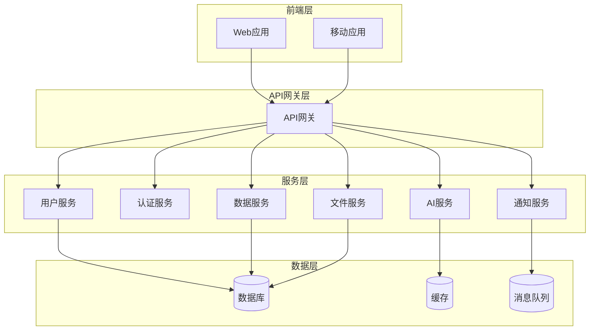

/**
 * @file 微服务拆分避坑指南
 * @description 提供YYC3-XY项目微服务架构拆分的实用指南，涵盖拆分原则、策略、常见陷阱和最佳实践
 * @module 技巧类-微服务拆分
 * @author YYC³
 * @version 1.0.0
 * @created 2025-01-30
 * @updated 2025-01-30
 * @copyright Copyright (c) 2025 YYC³
 * @license MIT
 */

# 微服务拆分避坑指南

## 文档信息
- **文档类型**：技巧类
- **所属阶段**：YYC3-XY-架构设计
- **遵循规范**：五高五标五化要求
- **版本号**：V1.0
- **最后更新**：2025-01-30

---

## 核心内容

### 1. 微服务拆分原则

#### 1.1 五高原则在微服务拆分中的体现

**高可用性**
- 每个服务独立部署，避免单点故障
- 服务间通过异步通信解耦
- 实现服务熔断和降级机制

**高性能**
- 服务按业务领域拆分，减少不必要的服务调用
- 合理使用缓存策略，降低服务间通信开销
- 优化数据访问模式，减少跨服务查询

**高安全性**
- 每个服务独立认证授权
- 服务间通信使用安全协议
- 实现细粒度的访问控制

**高扩展性**
- 服务可独立水平扩展
- 支持不同服务的不同扩展策略
- 便于引入新技术栈

**高可维护性**
- 服务职责单一，代码清晰
- 独立版本管理和部署
- 便于团队并行开发

#### 1.2 五标原则在微服务拆分中的体现

**标准化**
- 统一的服务接口规范
- 标准化的服务通信协议
- 一致的错误处理机制

**规范化**
- 遵循DDD领域驱动设计
- 规范的服务拆分方法论
- 标准化的服务治理流程

**自动化**
- 自动化服务注册和发现
- 自动化部署和扩缩容
- 自动化监控和告警

**智能化**
- 智能服务路由和负载均衡
- 智能故障检测和自愈
- AI辅助服务拆分决策

**可视化**
- 服务拓扑可视化
- 调用链追踪可视化
- 监控指标可视化

#### 1.3 五化原则在微服务拆分中的体现

**流程化**
- 标准化的拆分流程
- 明确的评审和决策流程
- 流程化的服务治理

**文档化**
- 完整的服务文档
- API文档自动生成
- 架构决策记录（ADR）

**工具化**
- 统一的开发工具链
- 服务治理工具平台
- 自动化测试工具

**数字化**
- 数字化的服务资产
- 数字化的性能指标
- 数字化的质量度量

**生态化**
- 服务生态集成
- 技术栈生态支持
- 团队协作生态

---

### 2. 微服务拆分策略

#### 2.1 基于业务能力的拆分

**策略描述**
- 按照业务领域和业务能力拆分服务
- 每个服务负责一个或多个相关的业务能力
- 服务边界与业务边界对齐

**适用场景**
- 业务领域清晰，业务边界明确
- 团队按业务能力组织
- 需要快速响应业务变化

**实施步骤**
1. 识别业务能力和领域边界
2. 绘制业务能力映射图
3. 确定服务拆分候选
4. 评估拆分影响和风险
5. 制定拆分计划
6. 逐步实施拆分

**示例**
```
用户服务：用户注册、登录、信息管理
订单服务：订单创建、支付、发货
商品服务：商品管理、库存管理
支付服务：支付处理、退款处理
```

#### 2.2 基于数据的拆分

**策略描述**
- 按照数据所有权和访问模式拆分服务
- 每个服务拥有独立的数据存储
- 服务间通过API访问数据

**适用场景**
- 数据访问模式清晰
- 数据一致性要求可接受
- 需要独立的数据扩展

**实施步骤**
1. 识别数据实体和关系
2. 分析数据访问模式
3. 确定数据归属服务
4. 设计数据同步机制
5. 实施数据迁移
6. 验证数据一致性

**注意事项**
- 避免跨服务的数据查询
- 合理处理数据一致性
- 设计数据同步策略

#### 2.3 基于团队的拆分

**策略描述**
- 按照团队组织结构拆分服务
- 每个团队负责一个或多个服务
- 服务边界与团队边界对齐

**适用场景**
- 团队组织稳定
- 团队规模适中（2-10人）
- 需要提高团队自治性

**实施步骤**
1. 分析团队组织结构
2. 评估团队技能和经验
3. 确定服务责任分配
4. 建立团队协作机制
5. 制定服务交付流程
6. 持续优化团队结构

**优势**
- 提高团队自治性
- 减少跨团队协调
- 加快交付速度

#### 2.4 基于技术栈的拆分

**策略描述**
- 按照技术需求和特性拆分服务
- 不同服务可以使用不同的技术栈
- 技术选型与服务需求匹配

**适用场景**
- 不同服务有不同技术需求
- 需要引入新技术
- 技术团队有不同技术专长

**实施步骤**
1. 分析服务技术需求
2. 评估技术选型方案
3. 确定技术栈组合
4. 建立技术规范
5. 实施技术迁移
6. 持续技术演进

**注意事项**
- 控制技术栈复杂度
- 建立技术治理机制
- 确保服务间兼容性

---

### 3. 常见陷阱和解决方案

#### 3.1 过早拆分

**问题描述**
- 在系统规模较小时就开始拆分微服务
- 拆分带来的复杂度超过收益
- 团队经验和能力不足

**风险**
- 增加系统复杂度
- 降低开发效率
- 增加运维成本
- 影响系统性能

**解决方案**
- 评估拆分收益和成本
- 从单体应用开始，逐步演进
- 确保团队具备微服务经验
- 建立完善的基础设施

**判断标准**
- 团队规模超过10人
- 单体应用代码量超过10万行
- 部署时间超过30分钟
- 需要独立扩展某些模块

#### 3.2 服务粒度过细

**问题描述**
- 服务拆分粒度过细，导致服务数量过多
- 服务间通信频繁，性能下降
- 运维和管理成本增加

**风险**
- 网络延迟增加
- 分布式事务复杂
- 监控和调试困难
- 资源利用率低

**解决方案**
- 合理控制服务粒度
- 合并相关的小服务
- 优化服务间通信
- 使用服务聚合模式

**最佳实践**
- 每个服务2-5人负责
- 服务数量不超过20个
- 服务间调用深度不超过3层
- 单个服务代码量5000-20000行

#### 3.3 数据一致性处理不当

**问题描述**
- 跨服务的数据一致性处理复杂
- 分布式事务性能差
- 数据不一致导致业务错误

**风险**
- 数据不一致
- 业务逻辑错误
- 系统可靠性下降
- 用户体验差

**解决方案**
- 采用最终一致性模型
- 使用Saga模式处理长事务
- 实现补偿机制
- 设计幂等性操作

**技术方案**
```typescript
// Saga模式示例
interface SagaStep {
  execute: () => Promise<void>;
  compensate: () => Promise<void>;
}

class Saga {
  private steps: SagaStep[] = [];

  addStep(step: SagaStep) {
    this.steps.push(step);
  }

  async execute() {
    const executedSteps: SagaStep[] = [];
    
    try {
      for (const step of this.steps) {
        await step.execute();
        executedSteps.push(step);
      }
    } catch (error) {
      for (let i = executedSteps.length - 1; i >= 0; i--) {
        await executedSteps[i].compensate();
      }
      throw error;
    }
  }
}
```

#### 3.4 服务间通信设计不当

**问题描述**
- 服务间通信协议选择不当
- 同步调用导致性能问题
- 缺乏熔断和降级机制

**风险**
- 系统性能下降
- 服务雪崩效应
- 故障传播范围扩大
- 系统可用性降低

**解决方案**
- 合理选择同步/异步通信
- 实现服务熔断和降级
- 使用消息队列解耦
- 设计重试和超时机制

**技术方案**
```typescript
// 熔断器模式示例
class CircuitBreaker {
  private failureCount = 0;
  private lastFailureTime = 0;
  private state: 'CLOSED' | 'OPEN' | 'HALF_OPEN' = 'CLOSED';
  private readonly threshold = 5;
  private readonly timeout = 60000;

  async execute<T>(fn: () => Promise<T>): Promise<T> {
    if (this.state === 'OPEN') {
      if (Date.now() - this.lastFailureTime > this.timeout) {
        this.state = 'HALF_OPEN';
      } else {
        throw new Error('Circuit breaker is OPEN');
      }
    }

    try {
      const result = await fn();
      this.onSuccess();
      return result;
    } catch (error) {
      this.onFailure();
      throw error;
    }
  }

  private onSuccess() {
    this.failureCount = 0;
    this.state = 'CLOSED';
  }

  private onFailure() {
    this.failureCount++;
    this.lastFailureTime = Date.now();
    if (this.failureCount >= this.threshold) {
      this.state = 'OPEN';
    }
  }
}
```

#### 3.5 缺乏服务治理

**问题描述**
- 缺乏统一的服务注册和发现
- 没有负载均衡策略
- 缺乏监控和告警机制

**风险**
- 服务调用失败
- 资源分配不均
- 故障发现延迟
- 问题定位困难

**解决方案**
- 实现服务注册和发现
- 配置负载均衡策略
- 建立监控和告警系统
- 实现服务健康检查

**技术方案**
```typescript
// 服务注册和发现示例
class ServiceRegistry {
  private services: Map<string, ServiceInstance[]> = new Map();

  register(serviceName: string, instance: ServiceInstance) {
    const instances = this.services.get(serviceName) || [];
    instances.push(instance);
    this.services.set(serviceName, instances);
  }

  discover(serviceName: string): ServiceInstance | null {
    const instances = this.services.get(serviceName);
    if (!instances || instances.length === 0) {
      return null;
    }
    return this.loadBalance(instances);
  }

  private loadBalance(instances: ServiceInstance[]): ServiceInstance {
    const index = Math.floor(Math.random() * instances.length);
    return instances[index];
  }
}
```

#### 3.6 测试和部署复杂

**问题描述**
- 微服务测试复杂度高
- 部署流程繁琐
- 环境配置复杂

**风险**
- 测试覆盖率低
- 部署失败率高
- 环境不一致
- 回滚困难

**解决方案**
- 实现自动化测试
- 建立CI/CD流水线
- 使用容器化部署
- 实现蓝绿部署

**最佳实践**
- 单元测试覆盖率>80%
- 集成测试覆盖关键流程
- 端到端测试覆盖主要用户场景
- 自动化部署流程

---

### 4. 微服务拆分最佳实践

#### 4.1 拆分前准备

**评估准备**
- 评估业务复杂度和规模
- 评估团队能力和经验
- 评估基础设施支持
- 评估拆分收益和成本

**技术准备**
- 建立服务治理平台
- 实现服务注册和发现
- 配置监控和告警系统
- 建立CI/CD流水线

**团队准备**
- 培训微服务相关知识
- 建立跨团队协作机制
- 制定服务交付规范
- 建立应急响应流程

#### 4.2 拆分实施

**渐进式拆分**
- 从非核心服务开始
- 逐步拆分核心服务
- 保持系统稳定运行
- 持续优化和调整

**绞杀者模式**
- 在单体应用前建立API网关
- 逐步将功能迁移到新服务
- 最终移除旧代码
- 确保平滑过渡

**示例**
```typescript
// API网关路由配置
const routes = [
  {
    path: '/api/users',
    service: 'user-service',
    legacy: false
  },
  {
    path: '/api/orders',
    service: 'order-service',
    legacy: false
  },
  {
    path: '/api/products',
    service: 'monolith',
    legacy: true
  }
];
```

#### 4.3 拆分后治理

**服务治理**
- 建立服务目录和文档
- 实现服务版本管理
- 配置服务依赖关系
- 监控服务健康状态

**性能优化**
- 优化服务间通信
- 实现服务缓存策略
- 配置服务限流
- 优化数据库访问

**安全加固**
- 实现服务认证授权
- 加密服务间通信
- 配置安全策略
- 定期安全审计

---

### 5. YYC3-XY微服务架构示例

#### 5.1 服务拆分方案

```
YYC3-XY系统服务拆分：

1. 用户服务 (user-service)
   - 用户注册、登录
   - 用户信息管理
   - 权限管理

2. 认证服务 (auth-service)
   - JWT令牌管理
   - OAuth集成
   - 会话管理

3. AI服务 (ai-service)
   - AI模型调用
   - 对话管理
   - 智能推荐

4. 数据服务 (data-service)
   - 数据存储
   - 数据查询
   - 数据分析

5. 通知服务 (notification-service)
   - 消息推送
   - 邮件发送
   - 短信通知

6. 文件服务 (file-service)
   - 文件上传
   - 文件存储
   - 文件下载
```

#### 5.2 服务通信架构



#### 5.3 服务配置示例

```typescript
// 用户服务配置
export const userServiceConfig = {
  name: 'user-service',
  version: '1.0.0',
  port: 3001,
  
  database: {
    host: process.env.DB_HOST,
    port: parseInt(process.env.DB_PORT || '5432'),
    database: 'yyc3_users',
    username: process.env.DB_USERNAME,
    password: process.env.DB_PASSWORD,
  },
  
  cache: {
    host: process.env.CACHE_HOST,
    port: parseInt(process.env.CACHE_PORT || '6379'),
  },
  
  services: {
    auth: {
      url: process.env.AUTH_SERVICE_URL,
      timeout: 5000,
    },
    notification: {
      url: process.env.NOTIFICATION_SERVICE_URL,
      timeout: 3000,
    },
  },
  
  circuitBreaker: {
    threshold: 5,
    timeout: 60000,
  },
  
  rateLimit: {
    windowMs: 60000,
    max: 100,
  },
};
```

---

### 6. 微服务拆分检查清单

#### 6.1 拆分前检查

- [ ] 评估拆分收益和成本
- [ ] 确认团队具备微服务经验
- [ ] 建立完善的基础设施
- [ ] 制定详细的拆分计划
- [ ] 准备回滚方案

#### 6.2 拆分中检查

- [ ] 服务边界清晰合理
- [ ] 数据归属明确
- [ ] 接口设计规范
- [ ] 通信协议选择合理
- [ ] 测试覆盖充分

#### 6.3 拆分后检查

- [ ] 服务独立部署成功
- [ ] 服务间通信正常
- [ ] 数据一致性验证
- [ ] 性能指标达标
- [ ] 监控告警正常

---

### 7. 工具和框架推荐

#### 7.1 服务治理工具

**Consul**
- 服务注册和发现
- 健康检查
- KV存储
- YYC3推荐度：⭐⭐⭐⭐⭐

**Eureka**
- Netflix开源
- 服务注册中心
- YYC3推荐度：⭐⭐⭐⭐

**Nacos**
- 阿里开源
- 服务发现和配置管理
- YYC3推荐度：⭐⭐⭐⭐⭐

#### 7.2 API网关工具

**Kong**
- 开源API网关
- 插件丰富
- YYC3推荐度：⭐⭐⭐⭐⭐

**Traefik**
- 云原生网关
- 自动配置
- YYC3推荐度：⭐⭐⭐⭐

**Hono**
- 轻量级网关
- TypeScript原生
- YYC3推荐度：⭐⭐⭐⭐⭐

#### 7.3 消息队列工具

**RabbitMQ**
- 成熟稳定
- 协议支持丰富
- YYC3推荐度：⭐⭐⭐⭐⭐

**Kafka**
- 高吞吐量
- 分布式架构
- YYC3推荐度：⭐⭐⭐⭐

**Redis Streams**
- 轻量级
- 易于使用
- YYC3推荐度：⭐⭐⭐

---

## 附录

### A. 微服务拆分决策树

```
是否需要拆分微服务？
├─ 否
│  └─ 继续使用单体架构
└─ 是
   ├─ 团队规模 > 10人？
   │  ├─ 是 → 继续评估
   │  └─ 否 → 暂缓拆分
   ├─ 代码量 > 10万行？
   │  ├─ 是 → 继续评估
   │  └─ 否 → 暂缓拆分
   ├─ 部署时间 > 30分钟？
   │  ├─ 是 → 继续评估
   │  └─ 否 → 暂缓拆分
   ├─ 需要独立扩展模块？
   │  ├─ 是 → 开始拆分
   │  └─ 否 → 暂缓拆分
   └─ 基础设施完善？
      ├─ 是 → 开始拆分
      └─ 否 → 完善基础设施
```

### B. 服务拆分评估表

| 评估项 | 权重 | 评分 | 加权分 |
|--------|------|------|--------|
| 业务复杂度 | 20% | | |
| 团队能力 | 15% | | |
| 基础设施 | 15% | | |
| 拆分收益 | 25% | | |
| 拆分成本 | 25% | | |
| **总分** | 100% | | |

### C. 参考资源

**官方文档**
- 微服务模式：https://microservices.io/
- 领域驱动设计：https://domain-driven-design.org/
- 云原生应用：https://www.cncf.io/

**YYC3资源**
- YYC3架构规范：/docs/YYC3-XY-架构设计/架构类/
- YYC3技术栈：/docs/YYC3-XY-技术栈/
- YYC3最佳实践：/docs/YYC3-XY-最佳实践/

---

<div align="center">

> 「***YanYuCloudCube***」
> 「***<admin@0379.email>***」
> 「***Words Initiate Quadrants, Language Serves as Core for the Future***」
> 「***All things converge in the cloud pivot; Deep stacks ignite a new era of intelligence***」

</div>
