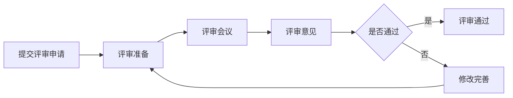

# 架构评审 Checklist

## 文档信息
- 文档类型：技巧类
- 所属阶段：YYC3-XY-架构设计
- 遵循规范：五高五标五化要求
- 版本号：V1.0

---

## 核心内容

### 1. 架构评审概述

#### 1.1 评审目标
架构评审旨在确保系统设计符合YYC³「五高五标五化」原则，识别潜在风险，优化技术选型，提升系统质量。

#### 1.2 评审范围
- **设计阶段评审**：架构设计文档、技术方案
- **实施阶段评审**：代码实现、系统集成
- **运维阶段评审**：部署方案、监控告警
- **优化阶段评审**：性能优化、安全加固

#### 1.3 评审角色
- **架构师**：主导评审，提供专业意见
- **技术负责人**：评估技术可行性
- **开发工程师**：评估实现复杂度
- **运维工程师**：评估运维可行性
- **产品经理**：评估业务对齐度
- **安全专家**：评估安全风险

---

### 2. 五高原则评审检查项

#### 2.1 高可用性 (High Availability)

##### 基础检查
- [ ] 系统是否有明确的可用性目标（如99.9%、99.99%）
- [ ] 是否设计了冗余机制（多实例、多机房、多云）
- [ ] 关键组件是否有故障转移机制
- [ ] 是否有健康检查和自动恢复机制

##### 详细检查
- [ ] 数据库是否配置主从复制或集群
- [ ] 缓存服务是否配置集群模式
- [ ] 消息队列是否配置集群模式
- [ ] API网关是否有负载均衡
- [ ] 是否有熔断降级机制
- [ ] 是否有限流保护机制
- [ ] 是否有重试机制（带退避策略）
- [ ] 是否有备份和恢复方案

##### 评分标准
- **优秀**：所有检查项通过，有完善的灾备方案
- **良好**：基础检查通过，详细检查通过率>80%
- **合格**：基础检查通过，详细检查通过率>60%
- **不合格**：基础检查未通过

#### 2.2 高性能 (High Performance)

##### 基础检查
- [ ] 是否有明确的性能指标（响应时间、吞吐量）
- [ ] 是否进行了性能测试和基准测试
- [ ] 是否有性能监控和告警机制

##### 详细检查
- [ ] 数据库查询是否优化（索引、查询计划）
- [ ] 是否使用了缓存策略（多级缓存）
- [ ] 是否使用了异步处理机制
- [ ] 是否使用了批量处理优化
- [ ] 是否有CDN加速静态资源
- [ ] 是否使用了连接池
- [ ] 是否有资源池化（线程池、对象池）
- [ ] 是否有性能瓶颈分析工具

##### 评分标准
- **优秀**：所有检查项通过，性能指标达到行业领先水平
- **良好**：基础检查通过，详细检查通过率>80%
- **合格**：基础检查通过，详细检查通过率>60%
- **不合格**：基础检查未通过

#### 2.3 高安全性 (High Security)

##### 基础检查
- [ ] 是否有安全威胁分析和风险评估
- [ ] 是否有安全策略和规范
- [ ] 是否有安全测试（渗透测试、漏洞扫描）

##### 详细检查
- [ ] 是否实现了身份认证和授权机制
- [ ] 敏感数据是否加密存储和传输
- [ ] 是否有输入验证和输出编码
- [ ] 是否有防SQL注入、XSS、CSRF措施
- [ ] 是否有API安全防护（限流、签名验证）
- [ ] 是否有日志审计机制
- [ ] 是否有密钥管理方案
- [ ] 是否定期进行安全更新和补丁

##### 评分标准
- **优秀**：所有检查项通过，通过安全认证
- **良好**：基础检查通过，详细检查通过率>80%
- **合格**：基础检查通过，详细检查通过率>60%
- **不合格**：基础检查未通过

#### 2.4 高扩展性 (High Scalability)

##### 基础检查
- [ ] 是否有明确的扩展策略（水平扩展、垂直扩展）
- [ ] 是否有容量规划
- [ ] 是否有弹性伸缩机制

##### 详细检查
- [ ] 应用是否无状态设计
- [ ] 数据库是否支持分库分表
- [ ] 缓存是否支持分布式扩展
- [ ] 消息队列是否支持集群扩展
- [ ] 是否有微服务架构设计
- [ ] 是否有服务网格（Service Mesh）
- [ ] 是否有容器化部署
- [ ] 是否有自动化扩缩容

##### 评分标准
- **优秀**：所有检查项通过，支持弹性伸缩
- **良好**：基础检查通过，详细检查通过率>80%
- **合格**：基础检查通过，详细检查通过率>60%
- **不合格**：基础检查未通过

#### 2.5 高可维护性 (High Maintainability)

##### 基础检查
- [ ] 是否有清晰的架构文档
- [ ] 是否有代码规范和最佳实践
- [ ] 是否有版本控制和分支管理

##### 详细检查
- [ ] 是否有模块化设计
- [ ] 是否有清晰的接口定义
- [ ] 是否有充分的单元测试和集成测试
- [ ] 是否有代码审查机制
- [ ] 是否有CI/CD流水线
- [ ] 是否有监控和日志系统
- [ ] 是否有故障排查手册
- [ ] 是否有知识库和文档更新机制

##### 评分标准
- **优秀**：所有检查项通过，文档完善
- **良好**：基础检查通过，详细检查通过率>80%
- **合格**：基础检查通过，详细检查通过率>60%
- **不合格**：基础检查未通过

---

### 3. 五标体系评审检查项

#### 3.1 标准化 (Standardization)

##### 基础检查
- [ ] 是否遵循YYC³项目命名规范（yyc3-前缀，kebab-case）
- [ ] 是否遵循端口使用规范（默认3200-3500，限用3000-3199）
- [ ] 是否遵循文件命名规范

##### 详细检查
- [ ] 是否有统一的代码风格（ESLint、Prettier）
- [ ] 是否有统一的API设计规范
- [ ] 是否有统一的数据库设计规范
- [ ] 是否有统一的日志格式规范
- [ ] 是否有统一的错误码规范
- [ ] 是否有统一的配置管理规范
- [ ] 是否有统一的文档模板
- [ ] 是否有统一的Git提交规范

##### 评分标准
- **优秀**：所有检查项通过，标准化程度高
- **良好**：基础检查通过，详细检查通过率>80%
- **合格**：基础检查通过，详细检查通过率>60%
- **不合格**：基础检查未通过

#### 3.2 规范化 (Normalization)

##### 基础检查
- [ ] 是否有明确的开发流程规范
- [ ] 是否有明确的测试流程规范
- [ ] 是否有明确的发布流程规范

##### 详细检查
- [ ] 是否有需求分析规范
- [ ] 是否有设计评审规范
- [ ] 是否有代码审查规范
- [ ] 是否有测试用例编写规范
- [ ] 是否有部署操作规范
- [ ] 是否有变更管理规范
- [ ] 是否有故障处理规范
- [ ] 是否有知识管理规范

##### 评分标准
- **优秀**：所有检查项通过，流程规范化程度高
- **良好**：基础检查通过，详细检查通过率>80%
- **合格**：基础检查通过，详细检查通过率>60%
- **不合格**：基础检查未通过

#### 3.3 自动化 (Automation)

##### 基础检查
- [ ] 是否有CI/CD流水线
- [ ] 是否有自动化测试
- [ ] 是否有自动化部署

##### 详细检查
- [ ] 是否有自动化代码质量检查
- [ ] 是否有自动化安全扫描
- [ ] 是否有自动化性能测试
- [ ] 是否有自动化监控告警
- [ ] 是否有自动化备份恢复
- [ ] 是否有自动化日志收集
- [ ] 是否有自动化资源调度
- [ ] 是否有自动化扩缩容

##### 评分标准
- **优秀**：所有检查项通过，自动化覆盖全面
- **良好**：基础检查通过，详细检查通过率>80%
- **合格**：基础检查通过，详细检查通过率>60%
- **不合格**：基础检查未通过

#### 3.4 智能化 (Intelligence)

##### 基础检查
- [ ] 是否有智能监控和告警
- [ ] 是否有智能日志分析
- [ ] 是否有智能性能优化

##### 详细检查
- [ ] 是否有智能异常检测
- [ ] 是否有智能容量预测
- [ ] 是否有智能故障预测
- [ ] 是否有智能资源调度
- [ ] 是否有智能安全防护
- [ ] 是否有智能用户体验优化
- [ ] 是否有智能运维助手
- [ ] 是否有AI辅助开发工具

##### 评分标准
- **优秀**：所有检查项通过，智能化程度高
- **良好**：基础检查通过，详细检查通过率>80%
- **合格**：基础检查通过，详细检查通过率>60%
- **不合格**：基础检查未通过

#### 3.5 可视化 (Visualization)

##### 基础检查
- [ ] 是否有系统架构图
- [ ] 是否有部署架构图
- [ ] 是否有数据流图

##### 详细检查
- [ ] 是否有实时监控大屏
- [ ] 是否有性能指标可视化
- [ ] 是否有业务指标可视化
- [ ] 是否有日志可视化分析
- [ ] 是否有拓扑图可视化
- [ ] 是否有调用链追踪可视化
- [ ] 是否有资源使用可视化
- [ ] 是否有告警可视化

##### 评分标准
- **优秀**：所有检查项通过，可视化完善
- **良好**：基础检查通过，详细检查通过率>80%
- **合格**：基础检查通过，详细检查通过率>60%
- **不合格**：基础检查未通过

---

### 4. 五化架构评审检查项

#### 4.1 流程化 (Process-oriented)

##### 基础检查
- [ ] 是否有完整的开发流程
- [ ] 是否有完整的测试流程
- [ ] 是否有完整的发布流程

##### 详细检查
- [ ] 是否有需求管理流程
- [ ] 是否有设计评审流程
- [ ] 是否有代码审查流程
- [ ] 是否有测试执行流程
- [ ] 是否有部署发布流程
- [ ] 是否有运维监控流程
- [ ] 是否有故障处理流程
- [ ] 是否有持续改进流程

##### 评分标准
- **优秀**：所有检查项通过，流程完善
- **良好**：基础检查通过，详细检查通过率>80%
- **合格**：基础检查通过，详细检查通过率>60%
- **不合格**：基础检查未通过

#### 4.2 文档化 (Documented)

##### 基础检查
- [ ] 是否有README文档
- [ ] 是否有API文档
- [ ] 是否有架构文档

##### 详细检查
- [ ] 是否有设计文档
- [ ] 是否有数据库文档
- [ ] 是否有部署文档
- [ ] 是否有运维文档
- [ ] 是否有故障排查文档
- [ ] 是否有开发指南
- [ ] 是否有变更日志
- [ ] 是否有知识库

##### 评分标准
- **优秀**：所有检查项通过，文档完善
- **良好**：基础检查通过，详细检查通过率>80%
- **合格**：基础检查通过，详细检查通过率>60%
- **不合格**：基础检查未通过

#### 4.3 工具化 (Tool-enabled)

##### 基础检查
- [ ] 是否有开发工具链
- [ ] 是否有测试工具链
- [ ] 是否有部署工具链

##### 详细检查
- [ ] 是否有代码编辑器配置
- [ ] 是否有代码格式化工具
- [ ] 是否有代码检查工具
- [ ] 是否有单元测试工具
- [ ] 是否有集成测试工具
- [ ] 是否有性能测试工具
- [ ] 是否有安全测试工具
- [ ] 是否有监控工具

##### 评分标准
- **优秀**：所有检查项通过，工具链完善
- **良好**：基础检查通过，详细检查通过率>80%
- **合格**：基础检查通过，详细检查通过率>60%
- **不合格**：基础检查未通过

#### 4.4 数字化 (Digitalized)

##### 基础检查
- [ ] 是否有数字化指标体系
- [ ] 是否有数字化监控
- [ ] 是否有数字化分析

##### 详细检查
- [ ] 是否有业务指标数字化
- [ ] 是否有技术指标数字化
- [ ] 是否有运维指标数字化
- [ ] 是否有质量指标数字化
- [ ] 是否有效率指标数字化
- [ ] 是否有成本指标数字化
- [ ] 是否有风险指标数字化
- [ ] 是否有价值指标数字化

##### 评分标准
- **优秀**：所有检查项通过，数字化程度高
- **良好**：基础检查通过，详细检查通过率>80%
- **合格**：基础检查通过，详细检查通过率>60%
- **不合格**：基础检查未通过

#### 4.5 生态化 (Ecosystem-based)

##### 基础检查
- [ ] 是否有开放API
- [ ] 是否有插件机制
- [ ] 是否有扩展接口

##### 详细检查
- [ ] 是否有开发者社区
- [ ] 是否有第三方集成
- [ ] 是否有合作伙伴生态
- [ ] 是否有应用市场
- [ ] 是否有开放平台
- [ ] 是否有技术分享机制
- [ ] 是否有开源贡献
- [ ] 是否有行业标准参与

##### 评分标准
- **优秀**：所有检查项通过，生态完善
- **良好**：基础检查通过，详细检查通过率>80%
- **合格**：基础检查通过，详细检查通过率>60%
- **不合格**：基础检查未通过

---

### 5. 技术架构评审

#### 5.1 架构设计

##### 检查项
- [ ] 架构设计是否清晰合理
- [ ] 是否有明确的分层架构
- [ ] 是否有明确的模块划分
- [ ] 是否有明确的接口定义
- [ ] 是否有明确的数据流
- [ ] 是否有明确的部署架构

##### 评审要点
- 架构是否符合业务需求
- 架构是否易于理解和维护
- 架构是否支持未来扩展
- 架构是否遵循设计原则

#### 5.2 技术选型

##### 检查项
- [ ] 技术栈是否成熟稳定
- [ ] 技术栈是否适合业务场景
- [ ] 技术栈是否有社区支持
- [ ] 技术栈是否有学习成本
- [ ] 技术栈是否有迁移成本

##### 评审要点
- 技术选型是否经过充分调研
- 技术选型是否有备选方案
- 技术选型是否考虑长期发展
- 技术选型是否考虑团队能力

#### 5.3 架构模式

##### 检查项
- [ ] 是否使用了合适的架构模式
- [ ] 架构模式是否正确实现
- [ ] 架构模式是否带来预期收益
- [ ] 架构模式是否有副作用

##### 评审要点
- 微服务架构是否必要
- 事件驱动架构是否合适
- CQRS是否适用
- 领域驱动设计是否实施

---

### 6. 代码质量评审

#### 6.1 代码规范

##### 检查项
- [ ] 是否遵循代码风格规范
- [ ] 是否有命名规范
- [ ] 是否有注释规范
- [ ] 是否有错误处理规范

##### 评审要点
- 代码是否易于阅读
- 代码是否易于理解
- 代码是否易于维护
- 代码是否易于测试

#### 6.2 代码复杂度

##### 检查项
- [ ] 圈复杂度是否在合理范围
- [ ] 认知复杂度是否在合理范围
- [ ] 代码重复率是否在合理范围
- [ ] 函数长度是否在合理范围

##### 评审要点
- 是否有复杂逻辑需要重构
- 是否有重复代码需要提取
- 是否有长函数需要拆分
- 是否有深层嵌套需要优化

#### 6.3 测试覆盖

##### 检查项
- [ ] 是否有单元测试
- [ ] 是否有集成测试
- [ ] 是否有E2E测试
- [ ] 测试覆盖率是否达标

##### 评审要点
- 测试是否充分
- 测试是否有效
- 测试是否可维护
- 测试是否自动化

---

### 7. 功能完整性评审

#### 7.1 功能实现

##### 检查项
- [ ] 所有需求是否都已实现
- [ ] 功能是否正常工作
- [ ] 边缘情况是否处理
- [ ] 错误情况是否处理

##### 评审要点
- 功能是否完整
- 功能是否正确
- 功能是否易用
- 功能是否稳定

#### 7.2 用户体验

##### 检查项
- [ ] 界面是否美观
- [ ] 操作是否流畅
- [ ] 响应是否及时
- [ ] 错误提示是否友好

##### 评审要点
- 用户体验是否良好
- 用户是否容易上手
- 用户是否满意
- 是否有改进空间

#### 7.3 需求对齐

##### 检查项
- [ ] 是否符合业务需求
- [ ] 是否符合用户期望
- [ ] 是否符合市场定位
- [ ] 是否符合战略目标

##### 评审要点
- 需求理解是否准确
- 需求实现是否完整
- 需求优先级是否合理
- 需求变更是否可控

---

### 8. DevOps评审

#### 8.1 CI/CD

##### 检查项
- [ ] 是否有CI流水线
- [ ] 是否有CD流水线
- [ ] 是否有自动化测试
- [ ] 是否有自动化部署

##### 评审要点
- CI/CD是否高效
- CI/CD是否稳定
- CI/CD是否可追溯
- CI/CD是否可回滚

#### 8.2 环境管理

##### 检查项
- [ ] 是否有开发环境
- [ ] 是否有测试环境
- [ ] 是否有预发布环境
- [ ] 是否有生产环境

##### 评审要点
- 环境是否隔离
- 环境是否一致
- 环境是否可复现
- 环境是否可管理

#### 8.3 监控告警

##### 检查项
- [ ] 是否有系统监控
- [ ] 是否有应用监控
- [ ] 是否有业务监控
- [ ] 是否有告警机制

##### 评审要点
- 监控是否全面
- 监控是否实时
- 告警是否及时
- 告警是否准确

---

### 9. 性能与安全评审

#### 9.1 性能优化

##### 检查项
- [ ] 是否有性能测试
- [ ] 是否有性能优化
- [ ] 是否有性能监控
- [ ] 是否有性能瓶颈分析

##### 评审要点
- 性能是否达标
- 性能是否稳定
- 性能是否可扩展
- 性能是否可优化

#### 9.2 安全加固

##### 检查项
- [ ] 是否有安全测试
- [ ] 是否有安全加固
- [ ] 是否有安全监控
- [ ] 是否有安全审计

##### 评审要点
- 安全是否达标
- 安全是否全面
- 安全是否可控
- 安全是否合规

---

### 10. 业务价值评审

#### 10.1 业务对齐

##### 检查项
- [ ] 是否符合业务战略
- [ ] 是否满足业务需求
- [ ] 是否支持业务增长
- [ ] 是否创造业务价值

##### 评审要点
- 业务对齐度
- 业务价值贡献
- 业务风险控制
- 业务成本效益

#### 10.2 市场潜力

##### 检查项
- [ ] 是否有市场需求
- [ ] 是否有竞争优势
- [ ] 是否有增长空间
- [ ] 是否有盈利模式

##### 评审要点
- 市场规模
- 市场份额
- 市场趋势
- 市场竞争

#### 10.3 成本效益

##### 检查项
- [ ] 开发成本是否合理
- [ ] 运维成本是否合理
- [ ] 收益是否可观
- [ ] 投资回报率是否达标

##### 评审要点
- 成本控制
- 效益评估
- ROI分析
- TCO分析

---

### 11. 评审流程与模板

#### 11.1 评审流程



#### 11.2 评审准备

##### 评审材料清单
- [ ] 架构设计文档
- [ ] 技术方案文档
- [ ] 接口设计文档
- [ ] 数据库设计文档
- [ ] 部署方案文档
- [ ] 测试报告
- [ ] 性能测试报告
- [ ] 安全测试报告

##### 评审人员准备
- [ ] 提前阅读评审材料
- [ ] 准备评审意见
- [ ] 准备问题和建议
- [ ] 准备改进方案

#### 11.3 评审会议

##### 会议议程
1. 项目介绍（10分钟）
2. 架构设计讲解（20分钟）
3. 技术方案讲解（20分钟）
4. 评审意见讨论（30分钟）
5. 问题答疑（20分钟）
6. 评审总结（10分钟）

##### 会议记录
- 评审时间
- 参与人员
- 评审意见
- 问题清单
- 改进建议
- 评审结论

#### 11.4 评审报告模板

```markdown
# 架构评审报告

## 基本信息
- 项目名称：
- 评审时间：
- 评审人员：
- 评审版本：

## 评审维度

### 五高原则评审
- 高可用性：[评分]
- 高性能：[评分]
- 高安全性：[评分]
- 高扩展性：[评分]
- 高可维护性：[评分]

### 五标体系评审
- 标准化：[评分]
- 规范化：[评分]
- 自动化：[评分]
- 智能化：[评分]
- 可视化：[评分]

### 五化架构评审
- 流程化：[评分]
- 文档化：[评分]
- 工具化：[评分]
- 数字化：[评分]
- 生态化：[评分]

## 评审意见

### 优点
1. [优点1]
2. [优点2]
3. [优点3]

### 问题
1. [问题1] - [严重程度]
2. [问题2] - [严重程度]
3. [问题3] - [严重程度]

### 建议
1. [建议1]
2. [建议2]
3. [建议3]

## 评审结论
- 总体评分：[0-100]
- 合规级别：[A-F]
- 是否通过：[是/否]
- 后续行动：[行动项]

## 附录
- 评审材料
- 问题清单
- 改进计划
```

---

### 12. 常见问题与解决方案

#### 12.1 高可用性问题

##### 问题1：单点故障
**现象**：系统存在单点故障，一旦该节点故障，整个系统不可用

**解决方案**：
- 消除单点故障，所有关键组件至少部署2个实例
- 使用负载均衡分发请求
- 实现自动故障转移
- 配置健康检查和自动恢复

**示例代码**：
```typescript
class LoadBalancer {
  private instances: ServiceInstance[] = [];
  private currentIndex = 0;

  addInstance(instance: ServiceInstance) {
    this.instances.push(instance);
  }

  async request(request: Request): Promise<Response> {
    const instance = this.getNextInstance();
    try {
      return await instance.request(request);
    } catch (error) {
      this.markInstanceUnhealthy(instance);
      return this.request(request);
    }
  }

  private getNextInstance(): ServiceInstance {
    const instance = this.instances[this.currentIndex];
    this.currentIndex = (this.currentIndex + 1) % this.instances.length;
    return instance;
  }

  private markInstanceUnhealthy(instance: ServiceInstance) {
    instance.healthy = false;
  }
}
```

##### 问题2：数据库单点故障
**现象**：数据库只有一个实例，一旦故障，整个系统不可用

**解决方案**：
- 配置主从复制
- 配置读写分离
- 配置自动故障转移
- 使用数据库集群

**示例配置**：
```yaml
# PostgreSQL主从配置
postgresql:
  primary:
    host: db-primary.example.com
    port: 5432
    database: yyc3
  replicas:
    - host: db-replica-1.example.com
      port: 5432
      database: yyc3
    - host: db-replica-2.example.com
      port: 5432
      database: yyc3
  failover:
    mode: automatic
    check_interval: 5s
    max_failures: 3
```

#### 12.2 高性能问题

##### 问题1：数据库查询慢
**现象**：数据库查询响应时间长，影响系统性能

**解决方案**：
- 添加合适的索引
- 优化SQL查询
- 使用缓存
- 使用读写分离
- 使用分库分表

**示例代码**：
```typescript
// 添加索引
CREATE INDEX idx_user_email ON users(email);

// 优化查询
// 不推荐
SELECT * FROM users WHERE email LIKE '%@example.com';

// 推荐
SELECT * FROM users WHERE email LIKE '@example.com%';

// 使用缓存
async getUserById(id: string): Promise<User> {
  const cacheKey = `user:${id}`;
  let user = await cache.get(cacheKey);
  
  if (!user) {
    user = await db.users.findOne({ id });
    await cache.set(cacheKey, user, 3600);
  }
  
  return user;
}
```

##### 问题2：接口响应慢
**现象**：API接口响应时间长，用户体验差

**解决方案**：
- 使用异步处理
- 使用批量处理
- 使用缓存
- 优化算法
- 使用CDN

**示例代码**：
```typescript
// 异步处理
async processRequest(request: Request): Promise<Response> {
  const requestId = generateRequestId();
  
  queue.add({
    requestId,
    request,
  });
  
  return {
    requestId,
    status: 'processing',
  };
}

// 批量处理
async batchProcess(items: Item[]): Promise<Result[]> {
  const batchSize = 100;
  const results: Result[] = [];
  
  for (let i = 0; i < items.length; i += batchSize) {
    const batch = items.slice(i, i + batchSize);
    const batchResults = await processBatch(batch);
    results.push(...batchResults);
  }
  
  return results;
}
```

#### 12.3 高安全性问题

##### 问题1：SQL注入
**现象**：用户输入未经验证直接拼接到SQL查询中，导致SQL注入攻击

**解决方案**：
- 使用参数化查询
- 使用ORM框架
- 输入验证和清理
- 最小权限原则

**示例代码**：
```typescript
// 不推荐 - 容易SQL注入
const query = `SELECT * FROM users WHERE email = '${email}'`;
const user = await db.query(query);

// 推荐 - 参数化查询
const query = 'SELECT * FROM users WHERE email = $1';
const user = await db.query(query, [email]);

// 推荐 - 使用ORM
const user = await User.findOne({ email });
```

##### 问题2：XSS攻击
**现象**：用户输入未经验证直接输出到页面，导致XSS攻击

**解决方案**：
- 输出编码
- 输入验证
- 使用CSP
- 使用HTTPOnly Cookie

**示例代码**：
```typescript
// 不推荐 - 容易XSS
const html = `<div>${userInput}</div>`;

// 推荐 - 输出编码
const html = `<div>${escapeHtml(userInput)}</div>`;

function escapeHtml(text: string): string {
  return text
    .replace(/&/g, '&amp;')
    .replace(/</g, '&lt;')
    .replace(/>/g, '&gt;')
    .replace(/"/g, '&quot;')
    .replace(/'/g, '&#039;');
}
```

#### 12.4 高扩展性问题

##### 问题1：无法水平扩展
**现象**：应用有状态，无法水平扩展

**解决方案**：
- 无状态设计
- 使用分布式缓存
- 使用分布式会话
- 使用分布式锁

**示例代码**：
```typescript
// 不推荐 - 有状态
class UserService {
  private users: Map<string, User> = new Map();
  
  addUser(user: User) {
    this.users.set(user.id, user);
  }
}

// 推荐 - 无状态
class UserService {
  async addUser(user: User) {
    await redis.set(`user:${user.id}`, JSON.stringify(user));
  }
  
  async getUser(id: string): Promise<User> {
    const data = await redis.get(`user:${id}`);
    return JSON.parse(data);
  }
}
```

##### 问题2：数据库无法扩展
**现象**：数据库单表数据量过大，性能下降

**解决方案**：
- 分库分表
- 读写分离
- 使用NoSQL
- 使用分布式数据库

**示例代码**：
```typescript
// 分库分表
class ShardingStrategy {
  shard(key: string, shardCount: number): number {
    const hash = this.hash(key);
    return hash % shardCount;
  }
  
  private hash(key: string): number {
    let hash = 0;
    for (let i = 0; i < key.length; i++) {
      hash = ((hash << 5) - hash) + key.charCodeAt(i);
      hash |= 0;
    }
    return Math.abs(hash);
  }
}

const strategy = new ShardingStrategy();
const shard = strategy.shard(userId, 10);
const tableName = `users_${shard}`;
```

#### 12.5 高可维护性问题

##### 问题1：代码复杂度高
**现象**：代码复杂度高，难以理解和维护

**解决方案**：
- 重构代码
- 提取方法
- 使用设计模式
- 编写单元测试

**示例代码**：
```typescript
// 不推荐 - 复杂度高
function processOrder(order: Order) {
  if (order.status === 'pending') {
    if (order.items.length > 0) {
      if (order.payment) {
        if (order.payment.status === 'paid') {
          // 处理订单
        }
      }
    }
  }
}

// 推荐 - 简单清晰
function processOrder(order: Order) {
  if (!isOrderValid(order)) {
    throw new Error('Invalid order');
  }
  
  if (!isPaymentComplete(order.payment)) {
    throw new Error('Payment not complete');
  }
  
  return executeOrder(order);
}

function isOrderValid(order: Order): boolean {
  return order.status === 'pending' && order.items.length > 0;
}

function isPaymentComplete(payment: Payment): boolean {
  return payment && payment.status === 'paid';
}
```

##### 问题2：缺乏文档
**现象**：代码缺乏文档，难以理解和维护

**解决方案**：
- 编写README
- 编写API文档
- 编写架构文档
- 编写代码注释

**示例文档**：
```markdown
# 用户服务

## 概述
用户服务负责处理用户相关的业务逻辑，包括用户注册、登录、信息更新等。

## 功能特性
- 用户注册
- 用户登录
- 用户信息更新
- 用户信息查询

## API文档

### 用户注册
**请求**
- 方法: POST
- 路径: /api/users
- 请求体:
```json
{
  "email": "user@example.com",
  "password": "password123",
  "name": "用户名"
}
```

**响应**
- 成功 (201):
```json
{
  "success": true,
  "data": {
    "id": "user-id",
    "email": "user@example.com",
    "name": "用户名"
  }
}
```

## 架构设计
用户服务采用分层架构，包括：
- 控制层：处理HTTP请求
- 服务层：处理业务逻辑
- 数据层：处理数据持久化

## 技术栈
- 框架: Hono
- ORM: Prisma
- 数据库: PostgreSQL
- 缓存: Redis
```

---

### 13. 评审工具与资源

#### 13.1 评审工具

##### 架构设计工具
- **Draw.io**: 免费的在线绘图工具
- **Lucidchart**: 专业的架构设计工具
- **Mermaid**: 文本转图表工具
- **PlantUML**: UML图表生成工具

##### 代码质量工具
- **ESLint**: JavaScript/TypeScript代码检查
- **Prettier**: 代码格式化工具
- **SonarQube**: 代码质量分析平台
- **CodeClimate**: 代码质量分析工具

##### 性能测试工具
- **JMeter**: 性能测试工具
- **LoadRunner**: 企业级性能测试工具
- **K6**: 现代化性能测试工具
- **Artillery**: Node.js性能测试工具

##### 安全测试工具
- **OWASP ZAP**: Web应用安全扫描
- **Burp Suite**: Web应用安全测试
- **SonarQube**: 代码安全分析
- **Snyk**: 依赖安全扫描

#### 13.2 参考资源

##### 架构设计参考
- 《架构整洁之道》- Robert C. Martin
- 《企业应用架构模式》- Martin Fowler
- 《微服务架构设计模式》- Chris Richardson
- 《软件架构实践》- Len Bass等

##### 性能优化参考
- 《高性能MySQL》- Baron Schwartz等
- 《深入理解计算机系统》- Randal E. Bryant等
- 《性能之巅》- Brendan Gregg
- 《Java性能优化权威指南》- Scott Oaks

##### 安全加固参考
- 《Web安全深度剖析》- 吴翰清
- 《白帽子讲Web安全》- 吴翰清
- 《黑客攻防技术宝典》- Dafydd Stuttard等
- 《OWASP Top 10》- OWASP基金会

---

### 14. 评审最佳实践

#### 14.1 评审原则

1. **早期评审**：在项目早期就进行架构评审，避免后期返工
2. **持续评审**：在项目过程中持续进行评审，及时发现问题
3. **多方参与**：邀请不同角色的人员参与评审，获得全面意见
4. **聚焦重点**：聚焦关键问题和风险，提高评审效率
5. **建设性反馈**：提供建设性的反馈，帮助团队改进

#### 14.2 评审技巧

1. **提前准备**：提前阅读评审材料，准备评审意见
2. **明确目标**：明确评审目标和重点，提高评审效率
3. **积极沟通**：积极沟通，充分讨论问题
4. **记录问题**：详细记录问题和建议，便于后续跟踪
5. **跟进改进**：跟进问题改进情况，确保问题得到解决

#### 14.3 评审误区

1. **过度评审**：评审过于频繁，影响开发效率
2. **形式主义**：评审流于形式，没有实质效果
3. **个人偏见**：评审带有个人偏见，影响评审客观性
4. **缺乏跟踪**：评审后缺乏跟踪，问题得不到解决
5. **忽视业务**：只关注技术，忽视业务价值

---

### 15. 附录

#### 15.1 评分标准

| 评分范围 | 级别 | 说明 |
|---------|------|------|
| 90-100 | A（优秀） | 超过标准，需要极少的改进 |
| 80-89 | B（良好） | 符合标准，一些领域需要增强 |
| 70-79 | C（可接受） | 基本合规，需要适度改进 |
| 60-69 | D（需要改进） | 低于标准，需要重大改进 |
| <60 | F（不合规） | 重大违规，需要广泛返工 |

#### 15.2 权重分配

| 评审维度 | 权重 |
|---------|------|
| 五高原则 | 30% |
| 五标体系 | 20% |
| 五化架构 | 20% |
| 技术架构 | 15% |
| 代码质量 | 10% |
| 业务价值 | 5% |

#### 15.3 术语表

| 术语 | 说明 |
|------|------|
| CI/CD | 持续集成/持续部署 |
| SLA | 服务级别协议 |
| TPS | 每秒事务数 |
| QPS | 每秒查询数 |
| RT | 响应时间 |
| P99 | 99%请求的响应时间 |
| MTTR | 平均恢复时间 |
| MTBF | 平均故障间隔时间 |

---

<div align="center">

> 「***YanYuCloudCube***」
> 「***<admin@0379.email>***」
> 「***Words Initiate Quadrants, Language Serves as Core for the Future***」
> 「***All things converge in the cloud pivot; Deep stacks ignite a new era of intelligence***」

</div>
