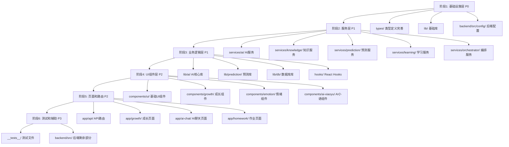

# YYC³ 全局类型定义推进计划

## 文档信息

| 项目 | 内容 |
|------|------|
| 文档版本 | v1.0 |
| 创建日期 | 2025-12-29 |
| 适用项目 | YYC³-小语智能成长守护系统 |
| 实施周期 | 8-12周 |

---

## 一、项目现状分析

### 1.1 类型安全现状

| 指标 | 当前状态 | 目标状态 |
|------|----------|----------|
| `any` 类型使用次数 | 1125次（.ts: 1014, .tsx: 111） | < 50次 |
| 类型定义文件数 | 19个 | 完善覆盖 |
| TypeScript 严格模式 | 已启用 | 持续优化 |
| 类型覆盖率 | 待评估 | > 95% |

### 1.2 模块分类统计

| 模块类别 | 文件数 | `any` 使用数 | 优先级 |
|----------|--------|--------------|--------|
| 核心类型定义 | 19 | 100+ | P0 |
| 基础设施层 | 30+ | 200+ | P0 |
| 服务层 | 40+ | 300+ | P1 |
| 业务逻辑层 | 50+ | 300+ | P1 |
| UI组件层 | 100+ | 200+ | P2 |
| 测试文件 | 20+ | 50+ | P3 |

### 1.3 已有类型定义模块

```
types/
├── common.ts              # 通用类型
├── database.ts            # 数据库类型
├── analytics.ts           # 分析类型
├── interaction.ts         # 交互类型
├── growth.ts              # 成长记录类型
├── curriculum.ts          # 课程类型
├── ai.ts                  # AI相关类型
├── ai-video.ts            # AI视频类型
├── ai-creative.ts         # AI创作类型
├── schedule.ts            # 日程类型
├── tools/common.ts        # 工具类型
├── prediction/common.ts   # 预测类型
├── orchestrator/common.ts # 编排器类型
├── learning/common.ts     # 学习类型
├── knowledge/common.ts    # 知识类型
├── goals/common.ts        # 目标类型
└── gateway/common.ts      # 网关类型
```

---

## 二、模块优先级排序

### 2.1 优先级定义

| 优先级 | 说明 | 实施周期 |
|--------|------|----------|
| P0 | 核心基础设施，影响所有模块 | 第1-2周 |
| P1 | 核心业务服务，影响主要功能 | 第3-6周 |
| P2 | UI组件层，影响用户体验 | 第7-9周 |
| P3 | 测试和辅助模块 | 第10-12周 |

### 2.2 模块推进顺序



---

## 三、详细实施计划

### 阶段1: 基础设施层完善 (第1-2周)

#### 1.1 types/ 模块 (第1周)

**目标**: 完善核心类型定义，消除类型定义中的 `any` 使用

**文件清单**:

- [ ] types/common.ts
- [ ] types/database.ts
- [ ] types/analytics.ts
- [ ] types/interaction.ts
- [ ] types/growth.ts
- [ ] types/curriculum.ts
- [ ] types/ai.ts
- [ ] types/ai-video.ts
- [ ] types/ai-creative.ts
- [ ] types/schedule.ts

**实施步骤**:

1. **types/common.ts** - 通用类型定义

   ```typescript
   // 替换 any 为具体类型
   export interface ApiResponse<T = unknown> {
     success: boolean
     data?: T
     error?: ApiError
   }

   export interface ApiError {
     code: string
     message: string
     details?: Record<string, unknown>
   }

   export type UserRole = 'parent' | 'child' | 'admin'

   export interface User {
     id: string
     name: string
     role: UserRole
     avatar?: string
     createdAt: Date
     updatedAt: Date
   }
   ```

2. **types/database.ts** - 数据库类型

   ```typescript
   // 定义完整的数据库表类型
   export interface DatabaseTable<T> {
     id: string
     created_at: Date
     updated_at: Date
     data: T
   }

   export interface GrowthRecord {
     id: string
     childId: string
     date: Date
     type: 'milestone' | 'daily' | 'assessment'
     content: string
     attachments?: MediaFile[]
   }
   ```

3. **types/ai.ts** - AI相关类型

   ```typescript
   export interface AIMessage {
     id: string
     role: 'user' | 'assistant' | 'system'
     content: string
     timestamp: Date
     metadata?: AIMessageMetadata
   }

   export interface AIMessageMetadata {
     confidence?: number
     emotion?: EmotionType
     model?: string
     tokens?: number
   }
   ```

**验证方法**:

```bash
# 类型检查
npx tsc --noEmit types/*.ts

# 统计 any 使用
grep -r "\bany\b" types/ | wc -l
```

**成功标准**:

- types/ 目录下 `any` 使用 < 10次
- 所有类型定义导出完整
- 类型覆盖率 > 95%

---

#### 1.2 lib/ 基础库 (第1-2周)

**目标**: 完善基础库类型，消除基础设施层的 `any` 使用

**文件清单**:

- [ ] lib/utils/type-guards.ts
- [ ] lib/db/client.ts
- [ ] lib/db/supabase-client.ts
- [ ] lib/db/database-manager.ts
- [ ] lib/api/client.ts
- [ ] lib/global-error-handler.ts
- [ ] lib/character-manager.ts

**实施步骤**:

1. **lib/utils/type-guards.ts** - 类型守卫

   ```typescript
   // 替换 any 为具体类型
   export function isObject(value: unknown): value is Record<string, unknown> {
     return typeof value === 'object' && value !== null
   }

   export function hasProperty<T extends PropertyKey>(
     obj: unknown,
     prop: T
   ): obj is Record<T, unknown> {
     return isObject(obj) && prop in obj
   }

   export function isApiError(error: unknown): error is ApiError {
     return (
       hasProperty(error, 'code') &&
       typeof error.code === 'string' &&
       hasProperty(error, 'message') &&
       typeof error.message === 'string'
     )
   }
   ```

2. **lib/db/database-manager.ts** - 数据库管理器

   ```typescript
   // 定义数据库操作类型
   export interface DatabaseConfig {
     url: string
     options?: DatabaseOptions
   }

   export interface DatabaseOptions {
     timeout?: number
     retryAttempts?: number
     retryDelay?: number
   }

   export class DatabaseManager {
     private config: DatabaseConfig
     private connection?: DatabaseConnection

     constructor(config: DatabaseConfig) {
       this.config = config
     }

     async connect(): Promise<void> {
       // 实现连接逻辑
     }

     async disconnect(): Promise<void> {
       // 实现断开逻辑
     }
   }
   ```

**验证方法**:

```bash
# 类型检查
npx tsc --noEmit lib/**/*.ts

# 运行测试
npm test -- lib/
```

**成功标准**:

- lib/ 目录下 `any` 使用 < 20次
- 所有基础库函数有完整类型定义
- 单元测试覆盖率 > 80%

---

#### 1.3 backend/src/config/ 后端配置 (第2周)

**目标**: 完善后端配置类型

**文件清单**:

- [ ] backend/src/config/config.ts
- [ ] backend/src/config/database.ts
- [ ] backend/src/config/logger.ts
- [ ] backend/src/config/migrator.ts
- [ ] backend/src/config/shared-config.ts

**实施步骤**:

1. **backend/src/config/config.ts** - 配置类型

   ```typescript
   export interface AppConfig {
     port: number
     env: 'development' | 'production' | 'test'
     database: DatabaseConfig
     logger: LoggerConfig
     ai: AIConfig
   }

   export interface DatabaseConfig {
     host: string
     port: number
     name: string
     user: string
     password: string
   }

   export interface LoggerConfig {
     level: 'debug' | 'info' | 'warn' | 'error'
     format: 'json' | 'text'
     output: 'console' | 'file' | 'both'
   }
   ```

**验证方法**:

```bash
# 类型检查
cd backend && npx tsc --noEmit

# 启动服务验证
npm run dev
```

**成功标准**:

- backend/src/config/ 下 `any` 使用 < 10次
- 配置验证完整
- 环境变量类型检查通过

---

### 阶段2: 服务层完善 (第3-6周)

#### 2.1 services/ai/ AI服务 (第3周)

**目标**: 完善AI服务类型定义

**文件清单**:

- [ ] services/ai/RAGEngine.ts
- [ ] services/api/KnowledgeAPIService.ts
- [ ] services/api/ToolAPIService.ts

**实施步骤**:

1. **services/ai/RAGEngine.ts** - RAG引擎

   ```typescript
   export interface RAGConfig {
     vectorStore: VectorStoreConfig
     retriever: RetrieverConfig
     generator: GeneratorConfig
   }

   export interface VectorStoreConfig {
     type: 'chromadb' | 'pinecone' | 'weaviate'
     embeddingModel: string
     collectionName: string
   }

   export interface RetrievalResult {
     documents: Document[]
     scores: number[]
     metadata: RetrievalMetadata
   }

   export class RAGEngine {
     private config: RAGConfig
     private vectorStore: VectorStore
     private retriever: Retriever
     private generator: Generator

     constructor(config: RAGConfig) {
       this.config = config
     }

     async query(query: string, options?: QueryOptions): Promise<RetrievalResult> {
       // 实现查询逻辑
     }
   }
   ```

**验证方法**:

```bash
# 类型检查
npx tsc --noEmit services/ai/**/*.ts

# 运行测试
npm test -- services/ai/
```

**成功标准**:

- services/ai/ 下 `any` 使用 < 30次
- 所有服务方法有完整类型定义
- 集成测试通过

---

#### 2.2 services/knowledge/ 知识服务 (第3-4周)

**目标**: 完善知识服务类型定义

**文件清单**:

- [ ] services/knowledge/KnowledgeBase.ts
- [ ] services/knowledge/KnowledgeManager.ts
- [ ] services/knowledge/KnowledgeGraphManager.ts
- [ ] services/knowledge/Neo4jService.ts
- [ ] services/knowledge/RecommendationEngine.ts

**实施步骤**:

1. **services/knowledge/KnowledgeBase.ts** - 知识库

   ```typescript
   export interface KnowledgeNode {
     id: string
     type: string
     properties: Record<string, unknown>
     relationships: Relationship[]
   }

   export interface Relationship {
     id: string
     type: string
     sourceId: string
     targetId: string
     properties: Record<string, unknown>
   }

   export interface KnowledgeQuery {
     nodeType?: string
     properties?: Record<string, unknown>
     relationshipType?: string
     limit?: number
   }

   export class KnowledgeBase {
     private graph: KnowledgeGraph

     async query(query: KnowledgeQuery): Promise<KnowledgeNode[]> {
       // 实现查询逻辑
     }

     async addNode(node: KnowledgeNode): Promise<string> {
       // 实现添加节点逻辑
     }
   }
   ```

**验证方法**:

```bash
# 类型检查
npx tsc --noEmit services/knowledge/**/*.ts

# 运行测试
npm test -- services/knowledge/
```

**成功标准**:

- services/knowledge/ 下 `any` 使用 < 40次
- 知识图谱操作类型完整
- 推荐算法类型定义清晰

---

#### 2.3 services/prediction/ 预测服务 (第4周)

**目标**: 完善预测服务类型定义

**文件清单**:

- [ ] services/prediction/index.ts
- [ ] services/prediction/model-selector.ts
- [ ] services/prediction/quality-monitor.ts

**实施步骤**:

1. **services/prediction/quality-monitor.ts** - 质量监控

   ```typescript
   export interface PredictionResult {
     id: string
     prediction: unknown
     confidence: number
     timestamp: Date
     metadata: PredictionMetadata
   }

   export interface PredictionMetadata {
     modelId: string
     version: string
     features: FeatureVector
     processingTime: number
   }

   export interface QualityMetrics {
     accuracy: number
     precision: number
     recall: number
     f1Score: number
     calibration: CalibrationMetrics
   }

   export class QualityMonitor {
     private metrics: QualityMetrics[]
     private thresholds: QualityThresholds

     async evaluate(predictions: PredictionResult[]): Promise<QualityMetrics> {
       // 实现评估逻辑
     }

     async detectDrift(): Promise<DriftDetectionResult> {
       // 实现漂移检测逻辑
     }
   }
   ```

**验证方法**:

```bash
# 类型检查
npx tsc --noEmit services/prediction/**/*.ts

# 运行测试
npm test -- services/prediction/
```

**成功标准**:

- services/prediction/ 下 `any` 使用 < 30次
- 预测模型类型定义完整
- 质量指标类型清晰

---

#### 2.4 services/learning/ 学习服务 (第5周)

**目标**: 完善学习服务类型定义

**文件清单**:

- [ ] services/learning/MetaLearningSystem.ts

**实施步骤**:

1. **services/learning/MetaLearningSystem.ts** - 元学习系统

   ```typescript
   export interface LearningTask {
     id: string
     type: string
     input: unknown
     expectedOutput: unknown
     metadata: TaskMetadata
   }

   export interface LearningModel {
     id: string
     architecture: string
     parameters: ModelParameters
     performance: ModelPerformance
     createdAt: Date
     updatedAt: Date
   }

   export interface LearningResult {
     taskId: string
     modelId: string
     prediction: unknown
     confidence: number
     loss: number
     metrics: PerformanceMetrics
   }

   export class MetaLearningSystem {
     private models: Map<string, LearningModel>
     private tasks: Map<string, LearningTask>

     async train(task: LearningTask): Promise<LearningModel> {
       // 实现训练逻辑
     }

     async predict(modelId: string, input: unknown): Promise<LearningResult> {
       // 实现预测逻辑
     }
   }
   ```

**验证方法**:

```bash
# 类型检查
npx tsc --noEmit services/learning/**/*.ts

# 运行测试
npm test -- services/learning/
```

**成功标准**:

- services/learning/ 下 `any` 使用 < 20次
- 学习模型类型定义完整
- 元学习算法类型清晰

---

#### 2.5 services/orchestrator/ 编排服务 (第5-6周)

**目标**: 完善编排服务类型定义

**文件清单**:

- [ ] services/orchestrator/ServiceOrchestrator.ts

**实施步骤**:

1. **services/orchestrator/ServiceOrchestrator.ts** - 服务编排器

   ```typescript
   export interface ServiceDefinition {
     id: string
     name: string
     type: string
     config: ServiceConfig
     dependencies: string[]
   }

   export interface Workflow {
     id: string
     name: string
     steps: WorkflowStep[]
     triggers: WorkflowTrigger[]
   }

   export interface WorkflowStep {
     id: string
     serviceId: string
     action: string
     input: unknown
     outputMapping?: Record<string, string>
     conditions?: StepCondition[]
   }

   export class ServiceOrchestrator {
     private services: Map<string, ServiceDefinition>
     private workflows: Map<string, Workflow>

     async executeWorkflow(workflowId: string, context: WorkflowContext): Promise<WorkflowResult> {
       // 实现工作流执行逻辑
     }

     async registerService(service: ServiceDefinition): Promise<void> {
       // 实现服务注册逻辑
     }
   }
   ```

**验证方法**:

```bash
# 类型检查
npx tsc --noEmit services/orchestrator/**/*.ts

# 运行测试
npm test -- services/orchestrator/
```

**成功标准**:

- services/orchestrator/ 下 `any` 使用 < 20次
- 工作流类型定义完整
- 服务编排类型清晰

---

### 阶段3: 业务逻辑层完善 (第6-8周)

#### 3.1 lib/ai/ AI核心库 (第6周)

**目标**: 完善AI核心库类型定义

**文件清单**:

- [✅] lib/ai/emotion-engine.ts
- [✅] lib/ai/voice-interaction.ts
- [✅] lib/ai/xiaoyu-multimodal-core.ts
- [✅] lib/ai/xiaoyu-philosophy-core.ts
- [✅] lib/ai/zhishu-ai-core.ts
- [✅] lib/ai/modular-ai-system.ts
- [✅] lib/ai/autonomous-engine.ts
- [✅] lib/ai/enhanced-emotion-fusion.ts
- [✅] lib/ai/enhanced-voice-services.ts
- [✅] lib/ai/enhanced-response-generator.ts
- [✅] lib/ai/enhanced-voice-system.ts
- [✅] lib/ai/role-coordinator.ts
- [✅] lib/ai/intelligent-feedback-system.ts
- [✅] lib/ai/intelligent-recommendation-system.ts
- [✅] lib/ai/performance-optimizer.ts
- [✅] lib/ai/xiaoyu-ai-mentor-system.ts

**实施步骤**:

1. **lib/ai/emotion-engine.ts** - 情感引擎

   ```typescript
   export interface EmotionInput {
     text?: string
     voice?: AudioData
     image?: ImageData
     context?: EmotionContext
   }

   export interface EmotionOutput {
     primaryEmotion: EmotionType
     confidence: number
     secondaryEmotions: EmotionScore[]
     sentiment: SentimentType
     intensity: number
   }

   export interface EmotionContext {
     userId: string
     conversationId?: string
     previousEmotions?: EmotionOutput[]
     userProfile: UserProfile
   }

   export class EmotionEngine {
     private model: EmotionModel
     private cache: EmotionCache

     async analyze(input: EmotionInput): Promise<EmotionOutput> {
       // 实现情感分析逻辑
     }

     async detectChange(current: EmotionOutput, previous: EmotionOutput): Promise<EmotionChange> {
       // 实现情感变化检测逻辑
     }
   }
   ```

**验证方法**:

```bash
# 类型检查
npx tsc --noEmit lib/ai/**/*.ts

# 运行测试
npm test -- lib/ai/
```

**成功标准**:

- lib/ai/ 下 `any` 使用 < 50次
- 情感分析类型定义完整
- 多模态融合类型清晰

---

#### 3.2 lib/prediction/ 预测库 (第6-7周)

**目标**: 完善预测库类型定义

**文件清单**:

- [✅] lib/prediction/base-predictor.ts
- [✅] lib/prediction/specialized-engines.ts

**实施步骤**:

1. **lib/prediction/base-predictor.ts** - 基础预测器

   ```typescript
   export interface PredictionInput {
     features: FeatureVector
     context: PredictionContext
     options?: PredictionOptions
   }

   export interface PredictionOutput {
     prediction: unknown
     confidence: number
     explanation?: PredictionExplanation
     metadata: PredictionMetadata
   }

   export interface PredictionContext {
     userId: string
     timestamp: Date
     previousPredictions?: PredictionOutput[]
     environment: EnvironmentContext
   }

   export abstract class BasePredictor<TInput extends PredictionInput, TOutput extends PredictionOutput> {
     protected model: Model<TInput, TOutput>

     abstract predict(input: TInput): Promise<TOutput>

     abstract train(data: TrainingData<TInput, TOutput>): Promise<TrainingResult>

     async evaluate(testData: TestData<TInput, TOutput>): Promise<EvaluationMetrics> {
       // 实现评估逻辑
     }
   }
   ```

**验证方法**:

```bash
# 类型检查
npx tsc --noEmit lib/prediction/**/*.ts

# 运行测试
npm test -- lib/prediction/
```

**成功标准**:

- lib/prediction/ 下 `any` 使用 < 30次
- 预测模型类型定义完整
- 评估指标类型清晰

---

#### 3.3 lib/db/ 数据库库 (第7周)

**目标**: 完善数据库库类型定义

**文件清单**:

- [✅] lib/db/client.ts
- [✅] lib/db/supabase-client.ts
- [✅] lib/db/database-manager.ts

**实施步骤**:

1. **lib/db/database-manager.ts** - 数据库管理器

   ```typescript
   export interface DatabaseClient {
     connect(): Promise<void>
     disconnect(): Promise<void>
     query<T>(sql: string, params?: unknown[]): Promise<T[]>
     transaction<T>(callback: (tx: Transaction) => Promise<T>): Promise<T>
   }

   export interface Transaction {
     query<T>(sql: string, params?: unknown[]): Promise<T[]>
     commit(): Promise<void>
     rollback(): Promise<void>
   }

   export interface QueryBuilder<T> {
     select(columns?: string[]): QueryBuilder<T>
     where(condition: WhereCondition): QueryBuilder<T>
     orderBy(column: string, direction?: 'asc' | 'desc'): QueryBuilder<T>
     limit(count: number): QueryBuilder<T>
     execute(): Promise<T[]>
   }

   export class DatabaseManager {
     private client: DatabaseClient

     async getTable<T>(tableName: string): Promise<Table<T>> {
       // 实现获取表逻辑
     }

     async createTable<T>(schema: TableSchema): Promise<void> {
       // 实现创建表逻辑
     }
   }
   ```

**验证方法**:

```bash
# 类型检查
npx tsc --noEmit lib/db/**/*.ts

# 运行测试
npm test -- lib/db/
```

**成功标准**:

- lib/db/ 下 `any` 使用 < 20次
- 数据库操作类型定义完整
- 事务类型清晰

---

#### 3.4 hooks/ React Hooks (第7-8周)

**目标**: 完善React Hooks类型定义

**文件清单**:

- [✅] hooks/useAIChat.ts
- [✅] hooks/useAICreative.ts
- [✅] hooks/useAIVideo.ts
- [✅] hooks/useAIXiaoyu.ts
- [✅] hooks/useAccessibility.ts
- [✅] hooks/useAuth.tsx
- [✅] hooks/useChildren.ts
- [✅] hooks/useCurriculum.ts
- [✅] hooks/useEmotionAnalysis.ts
- [✅] hooks/useEmotionMonitor.ts
- [✅] hooks/useGrowthRecords.ts
- [✅] hooks/useGrowthStage.ts
- [✅] hooks/useHomework.ts
- [✅] hooks/useInteractions.ts
- [✅] hooks/usePWA.ts
- [✅] hooks/useTranslation.ts

**实施步骤**:

1. **hooks/useAIChat.ts** - AI聊天Hook

   ```typescript
   export interface UseAIChatOptions {
     model?: string
     temperature?: number
     maxTokens?: number
     stream?: boolean
   }

   export interface UseAIChatReturn {
     messages: AIMessage[]
     isLoading: boolean
     error: Error | null
     sendMessage: (content: string) => Promise<void>
     clearMessages: () => void
     regenerateLastMessage: () => Promise<void>
   }

   export function useAIChat(options: UseAIChatOptions = {}): UseAIChatReturn {
     // 实现Hook逻辑
   }
   ```

**验证方法**:

```bash
# 类型检查
npx tsc --noEmit hooks/**/*.ts hooks/**/*.tsx

# 运行测试
npm test -- hooks/
```

**成功标准**:

- hooks/ 下 `any` 使用 < 30次
- 所有Hook有完整类型定义
- Hook测试覆盖率 > 80%

---

### 阶段4: UI组件层完善 (第8-10周)

#### 4.1 components/ui/ 基础UI组件 (第8-9周)

**目标**: 完善基础UI组件类型定义

**文件清单**:

- [ ] components/ui/button.tsx
- [ ] components/ui/card.tsx
- [ ] components/ui/dialog.tsx
- [ ] components/ui/input.tsx
- [ ] components/ui/select.tsx
- [ ] components/ui/table.tsx
- [ ] components/ui/character-themed/types.ts
- [ ] components/ui/character-themed/CharacterContainer.tsx

**实施步骤**:

1. **components/ui/button.tsx** - 按钮组件

   ```typescript
   export interface ButtonProps extends React.ButtonHTMLAttributes<HTMLButtonElement> {
     variant?: 'default' | 'destructive' | 'outline' | 'secondary' | 'ghost' | 'link'
     size?: 'default' | 'sm' | 'lg' | 'icon'
     asChild?: boolean
   }

   export const Button = React.forwardRef<HTMLButtonElement, ButtonProps>(
     ({ className, variant, size, asChild = false, ...props }, ref) => {
       // 实现组件逻辑
     }
   )
   Button.displayName = 'Button'
   ```

**验证方法**:

```bash
# 类型检查
npx tsc --noEmit components/ui/**/*.tsx

# 运行测试
npm test -- components/ui/
```

**成功标准**:

- components/ui/ 下 `any` 使用 < 40次
- 所有组件有完整Props类型定义
- 组件测试覆盖率 > 70%

---

#### 4.2 components/growth/ 成长组件 (第9周)

**目标**: 完善成长组件类型定义

**文件清单**:

- [ ] components/growth/GrowthDashboard.tsx
- [ ] components/growth/GrowthCharts.tsx
- [ ] components/growth/GrowthTimeline.tsx
- [ ] components/growth/AssessmentReport.tsx
- [ ] components/growth/CreateRecordModal.tsx
- [ ] components/growth/MilestoneDetector.tsx
- [ ] components/growth/StageIndicator.tsx
- [ ] components/growth/TagSelector.tsx
- [ ] components/growth/MediaUploader.tsx
- [ ] components/growth/enhanced/GrowthDataVisualization.tsx
- [ ] components/growth/enhanced/EnhancedMilestoneCelebration.tsx
- [ ] components/growth/enhanced/EnhancedMediaUploader.tsx
- [ ] components/growth/enhanced/EnhancedGrowthTimeline.tsx

**实施步骤**:

1. **components/growth/GrowthDashboard.tsx** - 成长大屏

   ```typescript
   export interface GrowthDashboardProps {
     childId: string
     dateRange?: DateRange
     viewMode?: 'overview' | 'detailed' | 'timeline'
     onRecordCreate?: (record: GrowthRecord) => void
     onRecordUpdate?: (recordId: string, updates: Partial<GrowthRecord>) => void
   }

   export interface GrowthChartData {
     date: Date
     milestones: number
     dailyRecords: number
     assessments: number
     overallScore: number
   }

   export const GrowthDashboard: React.FC<GrowthDashboardProps> = ({
     childId,
     dateRange,
     viewMode = 'overview',
     onRecordCreate,
     onRecordUpdate
   }) => {
     // 实现组件逻辑
   }
   ```

**验证方法**:

```bash
# 类型检查
npx tsc --noEmit components/growth/**/*.tsx

# 运行测试
npm test -- components/growth/
```

**成功标准**:

- components/growth/ 下 `any` 使用 < 50次
- 所有成长组件有完整Props类型定义
- 组件测试覆盖率 > 70%

---

#### 4.3 components/emotion/ 情绪组件 (第9-10周)

**目标**: 完善情绪组件类型定义

**文件清单**:

- [ ] components/emotion/EmotionMonitor.tsx

**实施步骤**:

1. **components/emotion/EmotionMonitor.tsx** - 情绪监控组件

   ```typescript
   export interface EmotionMonitorProps {
     childId: string
     refreshInterval?: number
     showChart?: boolean
     showHistory?: boolean
     onEmotionChange?: (emotion: EmotionData) => void
   }

   export interface EmotionData {
     timestamp: Date
     primaryEmotion: EmotionType
     confidence: number
     sentiment: SentimentType
     context?: string
   }

   export const EmotionMonitor: React.FC<EmotionMonitorProps> = ({
     childId,
     refreshInterval = 60000,
     showChart = true,
     showHistory = true,
     onEmotionChange
   }) => {
     // 实现组件逻辑
   }
   ```

**验证方法**:

```bash
# 类型检查
npx tsc --noEmit components/emotion/**/*.tsx

# 运行测试
npm test -- components/emotion/
```

**成功标准**:

- components/emotion/ 下 `any` 使用 < 20次
- 情绪组件有完整Props类型定义
- 组件测试覆盖率 > 70%

---

#### 4.4 components/ai-xiaoyu/ AI小语组件 (第10周)

**目标**: 完善AI小语组件类型定义

**文件清单**:

- [ ] components/ai-xiaoyu/FixedAIWidget.tsx

**实施步骤**:

1. **components/ai-xiaoyu/FixedAIWidget.tsx** - AI小语组件

   ```typescript
   export interface FixedAIWidgetProps {
     position?: 'bottom-right' | 'bottom-left' | 'top-right' | 'top-left'
     theme?: 'light' | 'dark' | 'auto'
     initialOpen?: boolean
     onMessageSent?: (message: string) => void
     onMessageReceived?: (message: AIMessage) => void
   }

   export interface AIWidgetState {
     isOpen: boolean
     messages: AIMessage[]
     isLoading: boolean
     error: Error | null
   }

   export const FixedAIWidget: React.FC<FixedAIWidgetProps> = ({
     position = 'bottom-right',
     theme = 'auto',
     initialOpen = false,
     onMessageSent,
     onMessageReceived
   }) => {
     // 实现组件逻辑
   }
   ```

**验证方法**:

```bash
# 类型检查
npx tsc --noEmit components/ai-xiaoyu/**/*.tsx

# 运行测试
npm test -- components/ai-xiaoyu/
```

**成功标准**:

- components/ai-xiaoyu/ 下 `any` 使用 < 20次
- AI小语组件有完整Props类型定义
- 组件测试覆盖率 > 70%

---

### 阶段5: 页面和路由完善 (第10-11周)

#### 5.1 app/api/ API路由 (第10周)

**目标**: 完善API路由类型定义

**文件清单**:

- [ ] app/api/ai/chat/route.ts
- [ ] app/api/ai/emotion/route.ts
- [ ] app/api/ai/enhanced-emotion/route.ts
- [ ] app/api/ai/analyze-record/route.ts
- [ ] app/api/ai/assessment-report/route.ts
- [ ] app/api/ai/continue-story/route.ts
- [ ] app/api/ai/generate-image/route.ts
- [ ] app/api/ai/orchestrate/route.ts
- [ ] app/api/children/route.ts
- [ ] app/api/growth-records/route.ts
- [ ] app/api/homework/route.ts
- [ ] app/api/homework/[id]/route.ts
- [ ] app/api/user-profile/route.ts
- [ ] app/api/error-report/route.ts

**实施步骤**:

1. **app/api/ai/chat/route.ts** - AI聊天API

   ```typescript
   export interface ChatRequest {
     message: string
     conversationId?: string
     context?: ChatContext
     options?: ChatOptions
   }

   export interface ChatResponse {
     message: string
     messageId: string
     conversationId: string
     metadata: ChatMetadata
   }

   export interface ChatContext {
     userId: string
     childId?: string
     previousMessages?: AIMessage[]
     userProfile?: UserProfile
   }

   export async function POST(request: Request): Promise<NextResponse> {
     const body: ChatRequest = await request.json()
     // 实现API逻辑
   }
   ```

**验证方法**:

```bash
# 类型检查
npx tsc --noEmit app/api/**/*.ts

# 运行测试
npm test -- app/api/
```

**成功标准**:

- app/api/ 下 `any` 使用 < 50次
- 所有API路由有完整请求/响应类型定义
- API测试覆盖率 > 80%

---

#### 5.2 app/ 页面组件 (第10-11周)

**目标**: 完善页面组件类型定义

**文件清单**:

- [ ] app/page.tsx
- [ ] app/growth/page.tsx
- [ ] app/growth/assessment/page.tsx
- [ ] app/[locale]/ai-chat/page.tsx
- [ ] app/[locale]/growth/page.tsx
- [ ] app/homework/page.tsx
- [ ] app/activities/page.tsx
- [ ] app/children/page.tsx
- [ ] app/profile/page.tsx
- [ ] app/settings/page.tsx

**实施步骤**:

1. **app/growth/page.tsx** - 成长页面

   ```typescript
   export interface GrowthPageProps {
     params: {
       locale?: string
     }
     searchParams: {
       childId?: string
       dateRange?: string
       view?: string
     }
   }

   export default function GrowthPage({ params, searchParams }: GrowthPageProps) {
     // 实现页面逻辑
   }
   ```

**验证方法**:

```bash
# 类型检查
npx tsc --noEmit app/**/*.tsx

# 运行测试
npm test -- app/
```

**成功标准**:

- app/ 下 `any` 使用 < 60次
- 所有页面组件有完整Props类型定义
- 页面测试覆盖率 > 60%

---

### 阶段6: 测试和辅助模块完善 (第11-12周)

#### 6.1 **tests**/ 测试文件 (第11-12周)

**目标**: 完善测试文件类型定义

**文件清单**:

- [ ] **tests**/setup.ts
- [ ] **tests**/custom-test-env.ts
- [ ] **tests**/hooks/useAIChat.test.ts
- [ ] **tests**/hooks/useAccessibility.test.ts
- [ ] **tests**/hooks/useGrowthRecords.test.ts
- [ ] **tests**/hooks/hooks.test.bun.ts
- [ ] **tests**/lib/character-manager.test.ts
- [ ] **tests**/lib/config.test.ts
- [ ] **tests**/lib/utils/formatDate.test.ts
- [ ] **tests**/lib/utils/helpers.test.ts
- [ ] **tests**/pages/profile.test.tsx
- [ ] **tests**/pages/settings.test.tsx

**实施步骤**:

1. ****tests**/hooks/useAIChat.test.ts** - AI聊天Hook测试

   ```typescript
   import { describe, it, expect, vi, beforeEach } from 'vitest'
   import { renderHook, waitFor } from '@testing-library/react'
   import { useAIChat } from '@/hooks/useAIChat'

   describe('useAIChat', () => {
     const mockOptions: UseAIChatOptions = {
       model: 'gpt-4',
       temperature: 0.7,
       maxTokens: 1000
     }

     beforeEach(() => {
       vi.clearAllMocks()
     })

     it('should initialize with empty messages', () => {
       const { result } = renderHook(() => useAIChat(mockOptions))
       expect(result.current.messages).toEqual([])
       expect(result.current.isLoading).toBe(false)
       expect(result.current.error).toBe(null)
     })

     it('should send message successfully', async () => {
       const { result } = renderHook(() => useAIChat(mockOptions))

       await waitFor(async () => {
         await result.current.sendMessage('Hello')
       })

       expect(result.current.messages).toHaveLength(2)
       expect(result.current.messages[0].role).toBe('user')
       expect(result.current.messages[1].role).toBe('assistant')
     })
   })
   ```

**验证方法**:

```bash
# 运行测试
npm test

# 检查测试覆盖率
npm run test:coverage
```

**成功标准**:

- **tests**/ 下 `any` 使用 < 30次
- 所有测试文件有完整类型定义
- 测试覆盖率 > 80%

---

#### 6.2 backend/src/ 后端剩余部分 (第12周)

**目标**: 完善后端剩余部分类型定义

**文件清单**:

- [ ] backend/src/controllers/aiController.ts
- [ ] backend/src/controllers/growthController.ts
- [ ] backend/src/controllers/authController.ts
- [ ] backend/src/middleware/auth.ts
- [ ] backend/src/middleware/errorHandler.ts
- [ ] backend/src/middleware/rateLimiter.ts
- [ ] backend/src/middleware/validation.ts
- [ ] backend/src/routes/ai.ts
- [ ] backend/src/routes/auth.ts
- [ ] backend/src/routes/growth.ts
- [ ] backend/src/routes/index.ts
- [ ] backend/src/types/index.ts

**实施步骤**:

1. **backend/src/controllers/aiController.ts** - AI控制器

   ```typescript
   import { Request, Response, NextFunction } from 'express'

   export interface AIControllerDependencies {
     aiService: AIService
     logger: Logger
   }

   export class AIController {
     private aiService: AIService
     private logger: Logger

     constructor(dependencies: AIControllerDependencies) {
       this.aiService = dependencies.aiService
       this.logger = dependencies.logger
     }

     async chat(req: Request, res: Response, next: NextFunction): Promise<void> {
       try {
         const request: ChatRequest = req.body
         const response: ChatResponse = await this.aiService.chat(request)
         res.json(response)
       } catch (error) {
         next(error)
       }
     }

     async analyzeEmotion(req: Request, res: Response, next: NextFunction): Promise<void> {
       try {
         const request: EmotionAnalysisRequest = req.body
         const response: EmotionAnalysisResponse = await this.aiService.analyzeEmotion(request)
         res.json(response)
       } catch (error) {
         next(error)
       }
     }
   }
   ```

**验证方法**:

```bash
# 类型检查
cd backend && npx tsc --noEmit

# 运行测试
cd backend && npm test
```

**成功标准**:

- backend/src/ 下 `any` 使用 < 50次
- 所有控制器、中间件、路由有完整类型定义
- 后端测试覆盖率 > 80%

---

## 四、验证和测试策略

### 4.1 类型检查

```bash
# 全局类型检查
npx tsc --noEmit

# 按模块类型检查
npx tsc --noEmit types/**/*.ts
npx tsc --noEmit lib/**/*.ts
npx tsc --noEmit services/**/*.ts
npx tsc --noEmit components/**/*.tsx
npx tsc --noEmit hooks/**/*.ts
npx tsc --noEmit app/**/*.tsx
npx tsc --noEmit backend/src/**/*.ts
```

### 4.2 类型覆盖率检查

```bash
# 安装 type-coverage 工具
npm install -g type-coverage

# 检查类型覆盖率
type-coverage --detail --strict

# 检查特定目录
type-coverage --detail --strict types/
type-coverage --detail --strict lib/
type-coverage --detail --strict services/
```

### 4.3 any 类型统计

```bash
# 统计全局 any 使用
grep -r "\bany\b" --include="*.ts" --include="*.tsx" | wc -l

# 统计各模块 any 使用
grep -r "\bany\b" --include="*.ts" types/ | wc -l
grep -r "\bany\b" --include="*.ts" lib/ | wc -l
grep -r "\bany\b" --include="*.ts" services/ | wc -l
grep -r "\bany\b" --include="*.tsx" components/ | wc -l
grep -r "\bany\b" --include="*.ts" hooks/ | wc -l
grep -r "\bany\b" --include="*.tsx" app/ | wc -l
```

### 4.4 测试覆盖率

```bash
# 运行测试并生成覆盖率报告
npm run test:coverage

# 检查覆盖率阈值
npm run test:coverage -- --threshold=80
```

---

## 五、成功标准

### 5.1 总体目标

| 指标 | 当前状态 | 目标状态 | 验证方法 |
|------|----------|----------|----------|
| `any` 类型使用 | 1125次 | < 50次 | grep统计 |
| 类型覆盖率 | 待评估 | > 95% | type-coverage |
| TypeScript 编译错误 | 待评估 | 0 | tsc --noEmit |
| 测试覆盖率 | 待评估 | > 80% | npm test:coverage |

### 5.2 模块目标

| 模块 | `any` 目标 | 类型覆盖率目标 | 测试覆盖率目标 |
|------|------------|----------------|----------------|
| types/ | < 10次 | 100% | N/A |
| lib/ | < 50次 | > 95% | > 80% |
| services/ | < 100次 | > 95% | > 80% |
| components/ | < 100次 | > 90% | > 70% |
| hooks/ | < 30次 | > 95% | > 80% |
| app/ | < 60次 | > 90% | > 60% |
| backend/ | < 50次 | > 95% | > 80% |

---

## 六、风险管理

### 6.1 潜在风险

| 风险 | 影响 | 概率 | 缓解措施 |
|------|------|------|----------|
| 类型定义不完整 | 高 | 中 | 建立类型审查机制 |
| 第三方库类型缺失 | 中 | 中 | 创建自定义类型声明 |
| 开发进度延迟 | 中 | 低 | 分模块推进，优先处理核心模块 |
| 类型错误影响功能 | 高 | 低 | 充分测试，建立回滚机制 |
| 团队成员不熟悉 | 低 | 中 | 提供培训和文档 |

### 6.2 回滚机制

```typescript
// 对于复杂的类型问题，可以暂时使用 @ts-ignore
// TODO: 完善类型定义
// @ts-ignore
const complexData: any = getComplexData()

// 使用类型断言作为临时方案
// TODO: 改进类型定义
const data = someFunction() as SomeType
```

---

## 七、培训和支持

### 7.1 培训计划

| 培训主题 | 时长 | 目标受众 |
|----------|------|----------|
| TypeScript 基础 | 2小时 | 全体开发人员 |
| 高级类型系统 | 3小时 | 核心开发人员 |
| 类型安全最佳实践 | 2小时 | 全体开发人员 |
| 工具链使用 | 1小时 | 全体开发人员 |

### 7.2 文档资源

- [TypeScript 官方文档](https://www.typescriptlang.org/docs/)
- [TypeScript Deep Dive](https://basarat.gitbook.io/typescript/)
- [Effective TypeScript](https://effectivetypescript.com/)
- 项目内部类型安全规范文档

---

## 八、监控和报告

### 8.1 周度报告

```markdown
## 类型安全周度报告

### 本周进度
- 完成模块: [模块列表]
- 修复 `any` 使用: [数量] 次
- 类型覆盖率: [百分比]%

### 下周计划
- 计划完成模块: [模块列表]
- 预计修复 `any` 使用: [数量] 次

### 遇到的问题
- [问题描述]
- [解决方案]
```

### 8.2 月度回顾

```markdown
## 类型安全月度回顾

### 本月成果
- 完成模块数: [数量]
- 总计修复 `any` 使用: [数量] 次
- 类型覆盖率提升: [百分比]%

### 下月目标
- 完成剩余模块
- 达到最终目标
```

---

## 九、附录

### 9.1 工具和命令

```bash
# 类型检查
npx tsc --noEmit

# 类型覆盖率
type-coverage --detail --strict

# Linting
npm run lint

# 测试
npm test
npm run test:coverage

# 构建
npm run build
```

### 9.2 常见问题

**Q: 如何处理第三方库的类型缺失？**

A: 创建自定义类型声明文件：

```typescript
// types/vendor.d.ts
declare module 'some-library' {
  export interface SomeType {
    property: string
  }
}
```

**Q: 如何处理复杂的联合类型？**

A: 使用类型守卫和类型断言：

```typescript
function isTypeA(value: unknown): value is TypeA {
  return typeof value === 'object' && value !== null && 'propertyA' in value
}

function process(value: TypeA | TypeB) {
  if (isTypeA(value)) {
    // value is TypeA
  } else {
    // value is TypeB
  }
}
```

**Q: 如何处理动态属性的对象？**

A: 使用索引签名：

```typescript
interface DynamicObject {
  [key: string]: unknown
  id: string
  createdAt: Date
}
```

---

## 十、总结

本类型分模块推进计划按照功能模块逐步实施，从基础设施层开始，向上层应用推进，确保类型安全改进不影响现有功能。通过系统性的模块划分和详细的实施步骤，可以在8-12周内完成全项目的类型安全改进，达到 `any` 类型使用 < 50次、类型覆盖率 > 95%、测试覆盖率 > 80% 的目标。

关键成功因素：

1. 严格按照模块优先级推进
2. 每个模块完成后进行充分测试
3. 建立类型审查机制
4. 提供充分的培训和支持
5. 持续监控和报告进度

---

> 「***YanYuCloudCube***」
> 「***<admin@0379.email>***」
> 「***Words Initiate Quadrants, Language Serves as Core for the Future***」
> 「***All things converge in the cloud pivot; Deep stacks ignite a new era of intelligence***」
